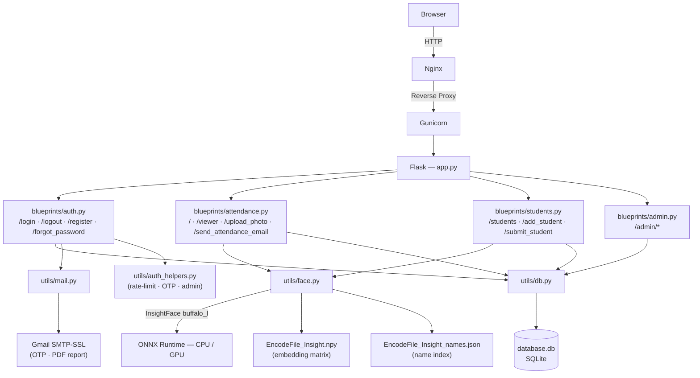

<div align="center">

<h1>🤖 Face Attendance System</h1>
<p><strong>Automated classroom attendance powered by InsightFace biometric recognition</strong></p>

[](https://www.python.org/)
[](https://flask.palletsprojects.com/)
[](https://github.com/deepinsight/insightface)
[](https://tailwindcss.com/)
[](https://www.sqlite.org/)
[](LICENSE)

</div>

---

## 📖 What Is This?

The **Face Attendance System** is a web application that replaces manual roll-calls with automatic, photo-based face recognition. A teacher uploads a classroom photo (or takes one with a webcam), and the system instantly identifies every student in the image, marks them present in the database, and provides a searchable record — all without any manual input.

---

## 🏗️ Architecture



---

## ✨ Features at a Glance

| Feature | Description |
|---|---|
| 🔍 **Face Recognition** | High-accuracy embeddings via InsightFace `buffalo_l` model |
| 📷 **Photo Upload / Webcam** | Upload images or capture directly from browser camera |
| 🤖 **Auto-Capture Mode** | Takes 5 webcam photos automatically and submits |
| 👥 **Group Photo Support** | Detects and identifies multiple faces in a single photo |
| 🏷️ **Lecture & Section Tagging** | Attendance linked to specific lectures and class sections |
| 🛡️ **Re-attendance Prevention** | Blocks duplicate marks within a configurable time window |
| 📊 **Live Attendance Viewer** | Filterable table with search, export (CSV/Excel/PDF/Print) |
| 📧 **Email PDF Reports** | Send styled attendance reports directly to any email |
| 👨‍💼 **Admin Dashboard** | 7-day trend chart, stats cards, student & user management |
| 🔐 **Secure Authentication** | bcrypt passwords, OTP email reset, account lockout |

---

## 🖥️ Tech Stack

```
Backend        Flask 3.1  ·  SQLite3  ·  Gunicorn (production)
Face AI        InsightFace buffalo_l  ·  ONNX Runtime  ·  OpenCV
Frontend       HTML  ·  TailwindCSS  ·  DataTables  ·  Chart.js
Email          smtplib SMTP-SSL  ·  ReportLab PDF
Deployment     Nginx reverse proxy  ·  python-dotenv config
```

---

## 📁 Project Structure

```
Face-Attendance-System-Web-Version/
│
├── app.py                        # Flask application factory + hooks
├── config.py                     # All settings (env-var driven)
├── encode_faces.py               # Batch re-encode all known_faces/
│
├── blueprints/                   # Route handlers (one file per domain)
│   ├── auth.py                   #   /login  /logout  /register  /forgot_password
│   ├── attendance.py             #   /  /viewer  /upload_photo  /send_attendance_email
│   ├── students.py               #   /students  /add_student  /submit_student
│   └── admin.py                  #   /admin/*
│
├── utils/                        # Shared helpers
│   ├── face.py                   #   InsightFace model + embedding I/O
│   ├── db.py                     #   SQLite connection + schema init
│   ├── auth_helpers.py           #   Rate-limiting, OTP, admin checks
│   └── mail.py                   #   SMTP email + PDF generation
│
├── templates/                    # Jinja2 HTML templates
│   ├── index.html                #   Main attendance upload page
│   ├── viewer.html               #   Attendance records viewer
│   ├── admin_dashboard.html      #   Admin dashboard with charts
│   └── ...                       #   (login, register, students, etc.)
│
├── static/                       # CSS / JS assets
├── known_faces/                  # Student reference photos (one per person)
├── EncodeFile_Insight.npy        # Stored face embeddings (numpy matrix)
├── EncodeFile_Insight_names.json # Student name index parallel to matrix
├── database.db                   # SQLite database
│
├── nginx/nginx.conf              # Production Nginx reverse-proxy config
├── start_face_attendance.sh      # One-command production start script
├── .env.example                  # Environment variable template
└── requirements.txt              # Python dependencies
```

---

## ⚙️ Setup & Installation

### 1 — Clone the repository

```bash
git clone https://github.com/ArnavPundir22/Face-Attendance-System-Web-Version.git
cd Face-Attendance-System-Web-Version
```

### 2 — Create a virtual environment and install dependencies

```bash
python3 -m venv .venv
source .venv/bin/activate          # Windows: .venv\Scripts\activate
pip install -r requirements.txt
```

### 3 — Configure environment variables

```bash
cp .env.example .env
```

Open `.env` and fill in your values:

```env
# Generate a secret key:  python3 -c "import secrets; print(secrets.token_hex(32))"
FLASK_SECRET_KEY=your_generated_secret_key

# Gmail App Password (NOT your Google account password)
# Guide: https://support.google.com/accounts/answer/185833
EMAIL_USER=your_gmail@gmail.com
EMAIL_PASS=your_gmail_app_password
```

> **Never commit `.env` to version control.** It is already listed in `.gitignore`.

### 4 — Add student photos and encode faces

Place one clear face photo per student in `known_faces/` named after the student:

```
known_faces/
    Arnav Pundir.jpg
    Jane Doe.jpg
    ...
```

Then run the batch encoder:

```bash
python3 encode_faces.py
```

This generates `EncodeFile_Insight.npy` and `EncodeFile_Insight_names.json`.

### 5 — Run the application

**Development:**
```bash
python3 app.py
# Open http://127.0.0.1:5000
```

**Production (Gunicorn):**
```bash
./start_face_attendance.sh
# Serves on 0.0.0.0:8000 behind Nginx
```

---

## 🔑 Configuration Reference

All settings live in `.env` (copied from `.env.example`). No code changes needed.

| Variable | Default | Description |
|---|---|---|
| `FLASK_SECRET_KEY` | *(required)* | Random secret for session signing |
| `EMAIL_USER` | *(required)* | Gmail address for sending OTPs and reports |
| `EMAIL_PASS` | *(required)* | Gmail App Password |
| `INSIGHTFACE_CTX_ID` | `-1` | `-1` = CPU, `0` = first GPU |
| `FACE_MATCH_THRESHOLD` | `0.3` | Cosine similarity threshold (0–1). Raise to reduce false positives |
| `REATTENDANCE_INTERVAL_MINUTES` | `10` | Minutes before same student can be marked again in same lecture |
| `LOGIN_MAX_ATTEMPTS` | `5` | Failed logins before account lockout |
| `LOGIN_LOCKOUT_MINUTES` | `15` | Lockout duration |
| `OTP_EXPIRY_MINUTES` | `10` | Password reset OTP validity window |
| `MIN_PASSWORD_LENGTH` | `8` | Minimum password length for users |
| `DB_FILE` | `database.db` | Path to SQLite database |
| `ENCODE_FILE_BASE` | `EncodeFile_Insight` | Base name for embedding files |
| `KNOWN_FACES_DIR` | `known_faces` | Directory containing student photos |

---

## 📝 Database Schema

**`students`** — registered student records
```
ID · Name · Program · Branch · Mobile · Gmail
```

**`attendance`** — attendance log entries
```
Student_ID · Name · Program · Branch · Mobile · Status · Timestamp · Lecture · Section
```

**`users`** — system login accounts
```
id · username · password (bcrypt) · is_admin · gmail
```

**`password_reset_tokens`** — OTP store for password resets
```
id · username · otp (SHA-256 hash) · expires_at · used
```

---

## 📷 How Face Recognition Works

```
1. Student photo added to known_faces/
         ↓
2. encode_faces.py (or Add Student form) → InsightFace extracts 512-dim embedding
         ↓
3. Embedding L2-normalised and saved to EncodeFile_Insight.npy
         ↓
4. At attendance time: uploaded photo → InsightFace extracts query embedding
         ↓
5. Cosine similarity: embedding_matrix @ query_embedding  (BLAS matrix multiply)
         ↓
6. Best match score ≥ FACE_MATCH_THRESHOLD → student identified → DB record written
```

**Why numpy matrix multiply?**
Instead of looping over every stored embedding in Python (slow), the entire comparison is done as a single BLAS matrix-vector multiply — 10–100× faster for large student rosters.

---

---

## 🔐 Security Notes

- Passwords are hashed with **bcrypt** — never stored in plaintext.
- All SQL queries use **parameterised placeholders** — no injection risk.
- OTPs are stored as **SHA-256 hashes** and compared using `secrets.compare_digest` (timing-safe).
- File uploads are sanitised with `werkzeug.secure_filename` — no path traversal.
- Account lockout activates after configurable failed login attempts.
- Nginx config adds `X-Frame-Options`, `X-Content-Type-Options`, and `Referrer-Policy` headers.

---

## 📬 Email Features

- **Password Reset:** User requests OTP → 6-digit code emailed → enter code + new password.
- **Attendance Report:** Filter the attendance table → click "Send Report via Email" → styled PDF delivered instantly.

---

## 🤝 Contributing

Pull requests and feature suggestions are welcome!

1. Fork the repository
2. Create a feature branch: `git checkout -b feature/your-feature`
3. Commit your changes: `git commit -m 'Add your feature'`
4. Push and open a Pull Request

---

## 💡 Roadmap

- [ ] Face liveness detection (anti-spoofing)
- [ ] Face quality checks (blur / tilt detection)
- [ ] PostgreSQL support for multi-worker deployments
- [ ] Export attendance to Google Sheets
- [ ] Docker / docker-compose setup
- [ ] REST API for mobile app integration

---

## 👨‍💻 Developer

**Arnav Pundir**
🎓 B.Tech CSE · COER University Roorkee
📧 [arnavp128@gmail.com](mailto:arnavp128@gmail.com)
🌐 [arnavpundir22.github.io](https://arnavpundir22.github.io)

---

<div align="center">
  <sub>Built with ❤️ using Flask · InsightFace · TailwindCSS</sub>
</div>
