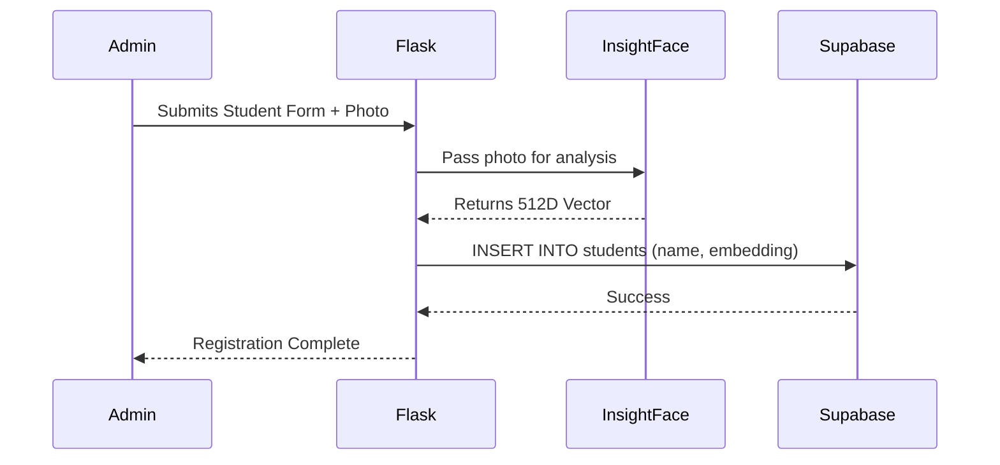

# 🏗️ BioSecure AI System Architecture

> **Note**: This is the legacy architecture overview, preserved for reference.
> See [Architecture.md](./Architecture.md) for the current canonical architecture document with Mermaid diagrams.
> See [SAD.md](./SAD.md) for the full System Architecture Document.
> See [TAD.md](./TAD.md) for the Technical Architecture Document with module-level detail.

The **BioSecure AI** application is a **stateless** web application. Heavy machine learning inference is handled locally by the Flask application via ONNX Runtime, but the complex mathematical task of matching faces is offloaded entirely to a PostgreSQL database powered by Supabase.

## System Flow

## Student Registration Flow

## Modular Code Architecture (Flask Blueprints)

1. **`auth` Blueprint (`blueprints/auth.py`)**: Integrates with Supabase Auth to handle user logins, logouts, registration of new user accounts, and credentials validation.
2. **`attendance` Blueprint (`blueprints/attendance.py`)**: Manages webcam/file uploads, processes uploaded images, calculates embeddings, matches faces via Supabase RPC, and serves the main dashboard.
3. **`students` Blueprint (`blueprints/students.py`)**: Handles showing registered students list and submitting new student data (saving local files to `known_faces/` and writing vectors to Supabase).
4. **`admin` Blueprint (`blueprints/admin.py`)**: Powers the admin area, including real-time user management (list, edit roles, delete accounts), dashboard stats generation, and the capture image viewer.

## The Tech Stack

### 1. Flask (Backend)
Flask handles all routing, session management, and HTML template rendering via the application factory pattern (`create_app()`).

### 2. InsightFace (AI Inference)
The `buffalo_l` model generates a 512-dimensional array (vector) for every face it detects, using ArcFace R100 architecture.

### 3. Supabase `pgvector` (Database)
The `match_face` RPC function computes cosine similarity (`<=>`) against all stored student embeddings and returns the closest match in milliseconds.

### 4. TailwindCSS & Vanilla JS (Frontend)
The frontend uses the BioSecure AI dark glassmorphism design system. See [design.md](./design.md) for the complete design system specification.
