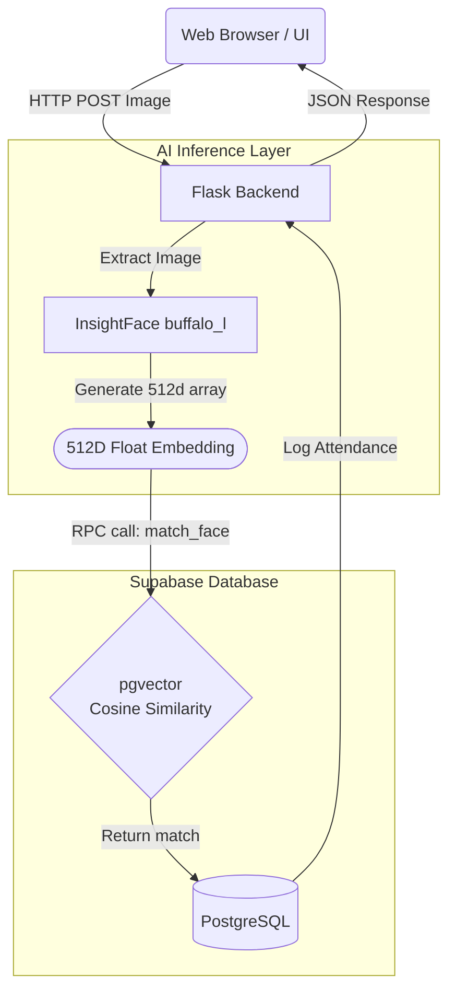
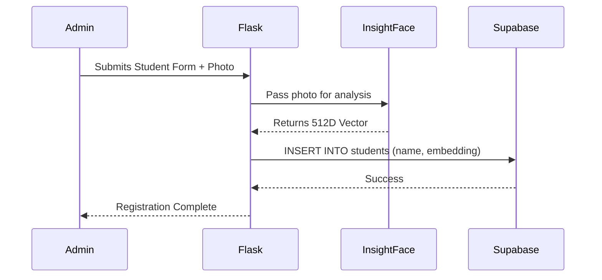

# 🏗️ Architecture

The Face Attendance System has been entirely rebuilt to be a **stateless** application. Heavy machine learning inference is handled locally by the Flask application via ONNX Runtime, but the complex mathematical task of matching faces is offloaded entirely to a PostgreSQL database powered by Supabase.

## System Flow
The diagram below illustrates the exact path an image takes from the user's browser, through the AI inference layer, and finally to the database for matching.

## Student Registration Flow
When an administrator registers a new student, the system bypasses local storage and writes the facial signature directly to the database.

## The Tech Stack

### 1. Flask (Backend)
Flask handles all routing, session management, and HTML template rendering. We use Flask because it seamlessly integrates with Python's rich data science and machine learning ecosystem.

### 2. InsightFace (AI Inference)
We use the `buffalo_l` model from the InsightFace library. It is widely considered one of the most accurate open-source facial recognition models available. It generates a 512-dimensional array (vector) for every face it detects.

### 3. Supabase `pgvector` (Database)
Supabase provides a powerful managed PostgreSQL database. By enabling the `pgvector` extension, we can store the 512-dimensional arrays directly in our database rows. When we need to recognize a face, we send the new array to Supabase, which uses **Cosine Similarity** (`<=>`) to instantly find the closest matching student.

### 4. TailwindCSS & Vanilla JS (Frontend)
The frontend utilizes a modern "dark glassmorphism" aesthetic built with TailwindCSS. It relies heavily on vanilla JavaScript to interact with the webcam (`navigator.mediaDevices.getUserMedia`) and to submit images to the Flask API.
