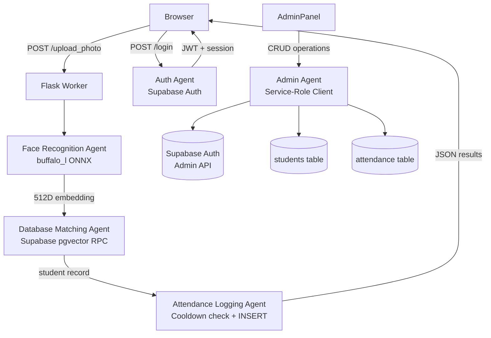

# 🤖 Agents — BioSecure AI

## Overview

BioSecure AI operates with a set of distinct **agents** — autonomous or semi-autonomous components that each own a specific responsibility domain. This document defines each agent, its role, its inputs/outputs, and its interaction protocols.

---

## Agent 1 — Face Recognition Agent

| Property | Value |
|---|---|
| **ID** | `agent.face` |
| **Runtime** | In-process (Python, Flask worker) |
| **Model** | InsightFace `buffalo_l` (ONNX Runtime) |
| **Compute** | CPU (INSIGHTFACE_CTX_ID=-1) or GPU (=0) |
| **Loaded at** | Application startup (`utils/face.py`) |

### Responsibility
Detect all human faces in an uploaded image and convert each detected face into a 512-dimensional L2-normalised embedding vector.

### Input
- Raw image bytes (JPEG/PNG), decoded via `cv2.imdecode`

### Output
- `List[Face]` — InsightFace face objects, each with `.bbox` and `.embedding`
- `np.ndarray` shape `(512,)` — normalised embedding per face

### Interaction Protocol
1. `blueprints/attendance.py → upload_photo()` receives HTTP POST with image files.
2. For each file, calls `model.get(frame)` from `utils/face.py`.
3. Each face's embedding is passed to the **Database Matching Agent**.
4. Annotated image (bounding boxes + labels drawn via OpenCV) is returned as base64 JPEG.

### Constraints
- One model instance shared across all workers (loaded at import time).
- Must not be imported before `config.py` is initialised.
- GPU support requires CUDA-enabled ONNX Runtime (`onnxruntime-gpu`).

---

## Agent 2 — Database Matching Agent

| Property | Value |
|---|---|
| **ID** | `agent.matcher` |
| **Runtime** | Supabase PostgreSQL (remote, via RPC) |
| **Function** | `match_face(query_embedding, match_threshold)` |
| **Extension** | `pgvector` (cosine similarity `<=>`) |

### Responsibility
Given a 512-dimensional query embedding, find the closest matching student record in the `students` table using cosine similarity, returning the student ID, name, and similarity score.

### Input
- `query_embedding`: `float[]` length 512
- `match_threshold`: `float` (default: 0.3)

### Output (SQL `RETURNS TABLE`)
```
id         text
name       text
similarity float
```

### Interaction Protocol
1. Called via `supabase.rpc('match_face', {...})` in `blueprints/attendance.py`.
2. Returns at most **1 result** (the top match above the threshold).
3. If no match found, returns an empty list → student labelled "Unknown".

### SQL Definition
```sql
CREATE OR REPLACE FUNCTION match_face(
  query_embedding vector(512),
  match_threshold float
) RETURNS TABLE (id text, name text, similarity float)
LANGUAGE sql STABLE AS $$
  SELECT id, name, 1 - (embedding <=> query_embedding) AS similarity
  FROM   students
  WHERE  embedding IS NOT NULL
    AND  1 - (embedding <=> query_embedding) >= match_threshold
  ORDER  BY embedding <=> query_embedding
  LIMIT  1;
$$;
```

---

## Agent 3 — Attendance Logging Agent

| Property | Value |
|---|---|
| **ID** | `agent.attendance` |
| **Runtime** | In-process (Python, Flask worker) |
| **Persistence** | Supabase `attendance` table |

### Responsibility
Given a verified face match, check the re-attendance cooldown, and if eligible, insert a new attendance record into the database.

### Input
- `student_id`, `name`, `program`, `branch`, `mobile` — from `students` table
- `status` — `"Present"` (auto) or `"Absent"` (admin-manual)
- `lecture`, `section` — from form input
- `timestamp` — server-generated `YYYY-MM-DD HH:MM:SS`

### Cooldown Check
Before inserting, queries the last attendance record for `(student_id, lecture)`:
```
SELECT timestamp FROM attendance
WHERE  student_id = $1 AND lecture = $2
ORDER  BY timestamp DESC LIMIT 1
```
If `(now - last_timestamp) < REATTENDANCE_INTERVAL_MINUTES` → returns `"Already Marked"`.

### Output
- `results[]` — list of `{name, status, confidence, timestamp}` per face
- `session_attendance[]` — array of rows for CSV export

---

## Agent 4 — Admin Agent

| Property | Value |
|---|---|
| **ID** | `agent.admin` |
| **Runtime** | In-process (Python, Flask worker) |
| **Auth** | Supabase Auth Admin API (`supabase_admin`) |
| **Access** | Service-role client only |

### Responsibility
Manages all privileged operations: user CRUD, student CRUD, analytics aggregation, and manual attendance marking.

### Sub-capabilities

| Operation | Method | Endpoint |
|---|---|---|
| List all users | `supabase_admin.auth.admin.list_users()` | `GET /admin/users` |
| Edit user | `supabase_admin.auth.admin.update_user_by_id()` | `POST /admin/user/edit/<id>` |
| Delete user | `supabase_admin.auth.admin.delete_user()` | `POST /admin/user/delete/<id>` |
| List students | `supabase_admin.table('students')` | `GET /admin/students` |
| Dashboard stats | `attendance` table count queries | `GET /admin/stats` |

### Safety Rules
- **Cannot delete self** — checked via `session.get('user_id') == user_id`.
- **Cannot remove last admin** — admin count checked before demotion/deletion.
- All routes guarded by `_require_admin()` decorator check.

---

## Agent 5 — Auth Agent

| Property | Value |
|---|---|
| **ID** | `agent.auth` |
| **Runtime** | Supabase Auth (remote) + Flask session |
| **Rate Limiter** | `utils/auth_helpers.py` (in-memory) |

### Responsibility
Authenticate users via Supabase email/password, manage Flask sessions, and provide registration for admin-created accounts.

### Session Schema
```python
session = {
    'logged_in':    True,
    'username':     str,   # from user_metadata.username
    'is_admin':     bool,  # from user_metadata.is_admin
    'user_id':      str,   # Supabase user UUID
    'access_token': str,   # Supabase JWT
}
```

### Rate Limiting
- Max `LOGIN_MAX_ATTEMPTS` failures per email → lockout for `LOGIN_LOCKOUT_MINUTES`.
- State stored in `utils/auth_helpers._login_attempts` (in-memory dict).

> [!WARNING]
> Rate limiting state is **not shared between Gunicorn workers**. For multi-worker production deployments, migrate to Redis-backed rate limiting.

---

## Agent Interaction Diagram


