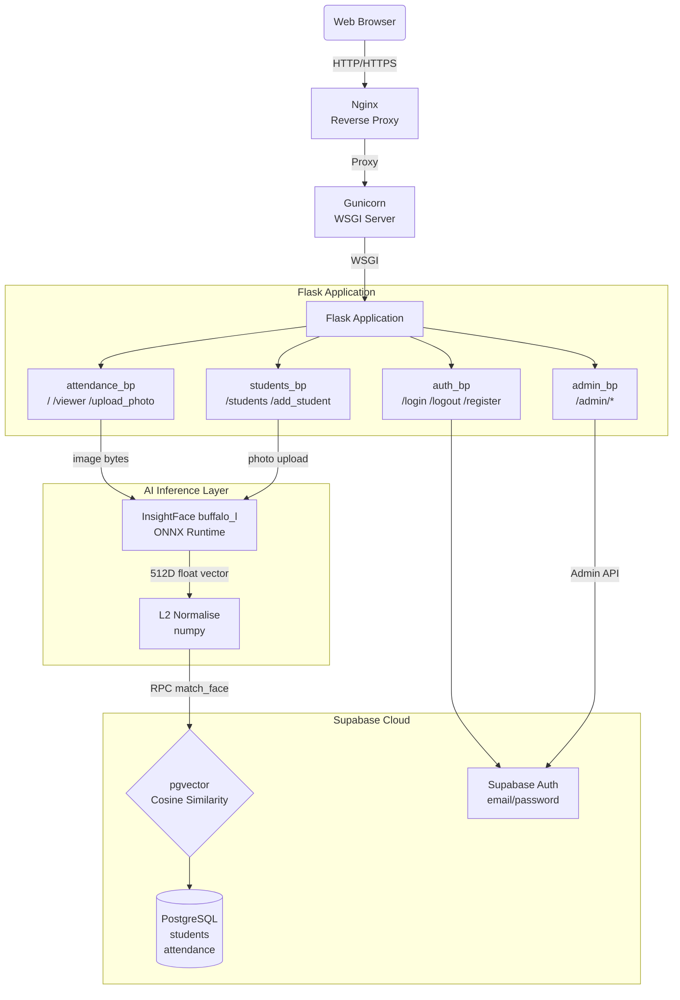
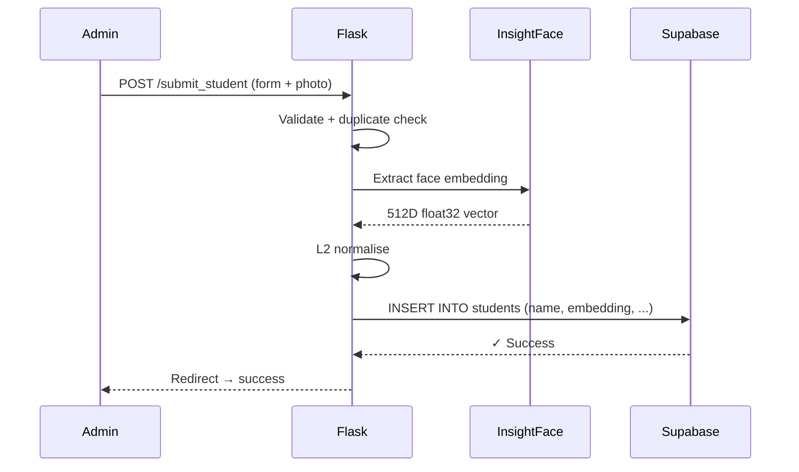
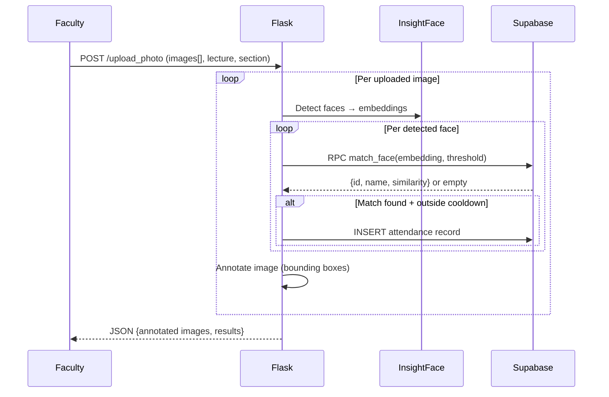

# 🏗️ Architecture — BioSecure AI

> **Quick Reference**: Canonical high-level architecture for onboarding and overview.
> For deep technical detail see [TAD.md](./TAD.md) and [SAD.md](./SAD.md).

---

## System Overview

**BioSecure AI** is a stateless web application. Machine learning inference (face detection + embedding) runs locally via ONNX Runtime, while all data persistence and vector similarity search is delegated to Supabase (managed PostgreSQL + pgvector).



---

## Student Registration Flow



---

## Attendance Marking Flow



---

## Modular Blueprint Architecture

| Blueprint | Prefix | Responsibility |
|---|---|---|
| `auth_bp` | (root) | Login, logout, admin-created user registration |
| `attendance_bp` | (root) | Attendance marking, viewer, photo upload API |
| `students_bp` | (root) | Student list, add student form + submission |
| `admin_bp` | `/admin` | Dashboard, user CRUD, student CRUD, manual marking |

---

## The Tech Stack

| Layer | Technology | Why |
|---|---|---|
| **Web Framework** | Flask 3.1 | Python-native; simple integration with ML libraries |
| **AI Inference** | InsightFace `buffalo_l` (ONNX) | State-of-the-art face recognition; CPU/GPU flexible |
| **Vector Search** | Supabase pgvector | Cosine similarity in PostgreSQL; eliminates local state |
| **Database** | Supabase PostgreSQL | Managed; handles Auth, RLS, and REST API |
| **Auth** | Supabase Auth | Email/password with metadata for admin roles |
| **WSGI Server** | Gunicorn | Stable, production-grade Python server |
| **Reverse Proxy** | Nginx | TLS, static files, security headers |
| **Frontend** | TailwindCSS + Vanilla JS | Zero build step; direct CDN integration |
| **Icons** | Lucide | Consistent, lightweight SVG icon set |
| **Fonts** | Geist + Inter (Google Fonts) | Premium, legible typography |

---

## Security Architecture

```
┌─ Public (no auth) ──────────────────────────┐
│  GET  /login                                 │
│  GET  /static/*                              │
│  GET  /healthz                               │
└──────────────────────────────────────────────┘
         │ session['logged_in'] required
         ▼
┌─ Authenticated Zone ────────────────────────┐
│  GET  /  (attendance marking)                │
│  GET  /viewer                                │
│  GET  /students                              │
│  POST /upload_photo                          │
│  POST /submit_student                        │
└──────────────────────────────────────────────┘
         │ session['is_admin'] = True required
         ▼
┌─ Admin Zone ────────────────────────────────┐
│  ALL  /admin/*                               │
│  GET/POST /register                          │
│  (Uses service-role Supabase client)         │
└──────────────────────────────────────────────┘
```
