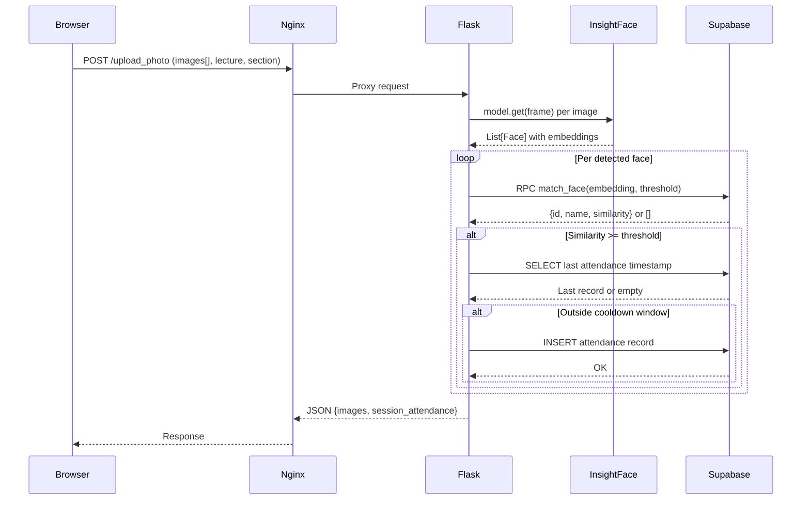
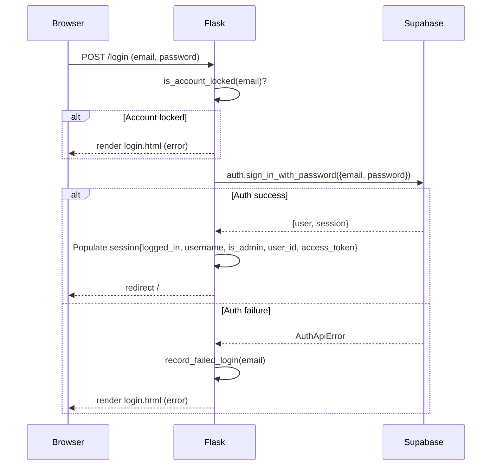
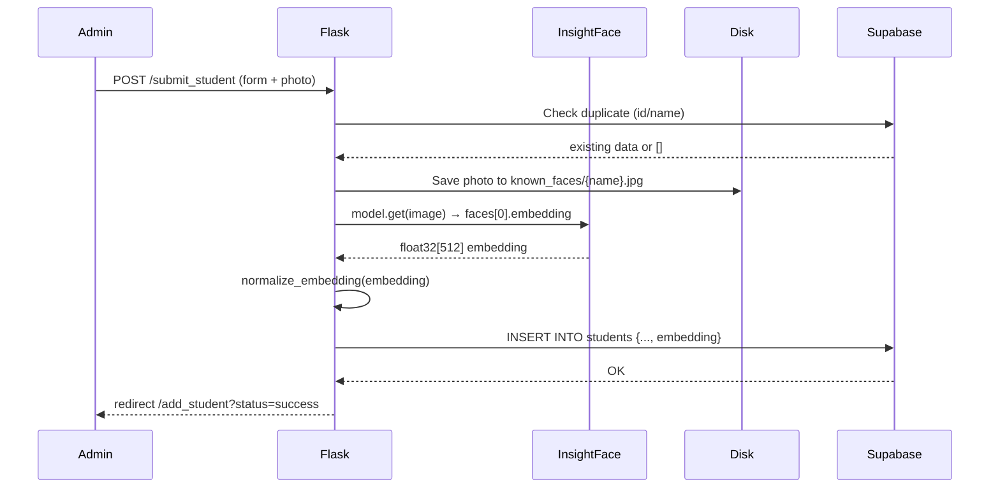

# 🗺️ System Architecture Document (SAD)
# BioSecure AI

**Version**: 2.0  
**Last Updated**: 2026-07-14  

---

## 1. System Overview

The BioSecure AI application is a **stateless web application** that offloads all data persistence and ML-powered vector search to Supabase (managed PostgreSQL). The application server (Flask + Gunicorn) is purely computational — it runs InsightFace inference locally and delegates storage to the cloud.

```
┌─────────────────────────────────────────────────────────────────────┐
│                        INTERNET / LAN                               │
└──────────────────────────────┬──────────────────────────────────────┘
                               │  HTTP/HTTPS
                               ▼
                     ┌─────────────────┐
                     │      Nginx      │  Reverse proxy + TLS termination
                     │   (Port 80/443) │  Static file serving
                     └────────┬────────┘
                              │  HTTP (127.0.0.1:8000)
                              ▼
                     ┌─────────────────┐
                     │    Gunicorn     │  WSGI server, 2 sync workers
                     │   (Port 8000)   │  120s timeout for ML inference
                     └────────┬────────┘
                              │  WSGI
                              ▼
              ┌───────────────────────────────┐
              │         Flask Application     │
              │  ┌───────────┐  ┌──────────┐  │
              │  │auth_bp    │  │admin_bp  │  │
              │  ├───────────┤  ├──────────┤  │
              │  │attendance │  │students  │  │
              │  │_bp        │  │_bp       │  │
              │  └───────────┘  └──────────┘  │
              │  ┌─────────────────────────┐  │
              │  │    utils/face.py        │  │
              │  │  InsightFace buffalo_l  │  │
              │  │  (ONNX Runtime, CPU)    │  │
              │  └─────────────────────────┘  │
              └───────────────┬───────────────┘
                              │  HTTPS REST + WebSocket
                              ▼
                     ┌─────────────────┐
                     │    Supabase     │
                     │  ┌───────────┐  │
                     │  │PostgreSQL │  │
                     │  │+pgvector  │  │
                     │  ├───────────┤  │
                     │  │  Auth     │  │
                     │  │  (email/  │  │
                     │  │  password)│  │
                     │  └───────────┘  │
                     └─────────────────┘
```

---

## 2. Component Descriptions

### 2.1 Nginx (Reverse Proxy)
- **Role**: TLS termination, static file serving, request forwarding
- **Static files**: Served directly (bypasses Flask) with `Cache-Control: max-age=604800`
- **Upload limit**: `client_max_body_size 20M` for group photos
- **Security headers**: X-Frame-Options, X-Content-Type-Options, Referrer-Policy
- **Config**: `nginx/nginx.conf`

### 2.2 Gunicorn (WSGI Server)
- **Role**: Production-grade Python WSGI server
- **Workers**: 2 sync workers (safe for 2 GB RAM)
- **Timeout**: 120s (InsightFace group-photo processing)
- **Config**: `gunicorn.conf.py`
- **Entry**: `app:app` (module `app`, attribute `app`)

### 2.3 Flask Application
- **Role**: Request routing, template rendering, business logic orchestration
- **Pattern**: Application factory (`create_app()`)
- **Blueprints**: 4 (auth, attendance, students, admin)
- **Sessions**: Server-side Flask sessions (signed cookies)

### 2.4 InsightFace Engine (`utils/face.py`)
- **Role**: Face detection and embedding extraction
- **Model**: `buffalo_l` (ArcFace R100, ~300MB, downloaded at first run)
- **Output**: 512-dimensional float32 embedding per face
- **Lifecycle**: Loaded once at worker startup, shared across requests

### 2.5 Supabase (BaaS)
- **Role**: Managed PostgreSQL + Auth + Storage
- **Tables**: `students` (with `vector(512)`), `attendance`
- **Extensions**: `pgvector`
- **Auth**: Supabase Auth (email/password)
- **Access Pattern**: Two clients — anon (RLS-constrained) and service-role (admin bypass)

---

## 3. Data Flow Diagrams

### 3.1 Attendance Marking Flow



### 3.2 Login Flow



### 3.3 Student Registration Flow



---

## 4. Environment Topology

### Development
```
Developer Machine
└── Flask dev server (python app.py)
    └── Supabase Cloud (shared project)
```

### Production (VPS)
```
Ubuntu 22.04 VPS
├── Nginx (port 80/443)
└── Gunicorn (127.0.0.1:8000)
    └── Flask + InsightFace
        └── Supabase Cloud
```

### Production (PaaS — Render/Railway)
```
PaaS Container
└── Gunicorn (0.0.0.0:$PORT)
    └── Flask + InsightFace
        └── Supabase Cloud
```

---

## 5. External Dependencies

| Dependency | Type | Purpose | Version |
|---|---|---|---|
| Supabase | Cloud BaaS | Database + Auth | Managed |
| InsightFace `buffalo_l` | AI Model | Face detection + embedding | Auto-downloaded |
| ONNX Runtime | ML runtime | InsightFace inference | 1.22.1 |
| OpenCV | Computer Vision | Image decoding + annotation | 4.12.0 |
| Gunicorn | WSGI server | Production serving | 23.0.0 |
| Nginx | Web server | Reverse proxy | System |

---

## 6. Security Boundaries

```
┌─ Public Zone ────────────────────────────────────────────────┐
│  /login, /static/*, /healthz, /favicon.ico                   │
└──────────────────────────────────────────────────────────────┘

┌─ Authenticated Zone ─────────────────────────────────────────┐
│  /, /viewer, /students, /add_student, /upload_photo,          │
│  /get_attendance_data, /submit_student                        │
└──────────────────────────────────────────────────────────────┘

┌─ Admin Zone ─────────────────────────────────────────────────┐
│  /admin/*, /register                                          │
│  Requires session.is_admin = True                            │
│  Uses supabase_admin (service-role, bypasses RLS)            │
└──────────────────────────────────────────────────────────────┘
```
