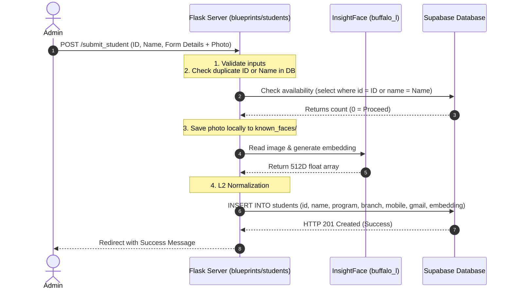
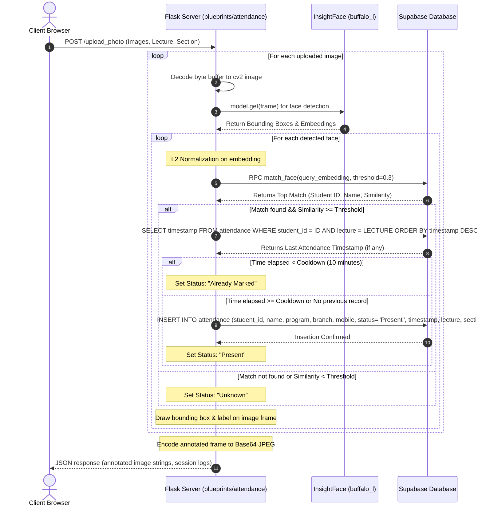
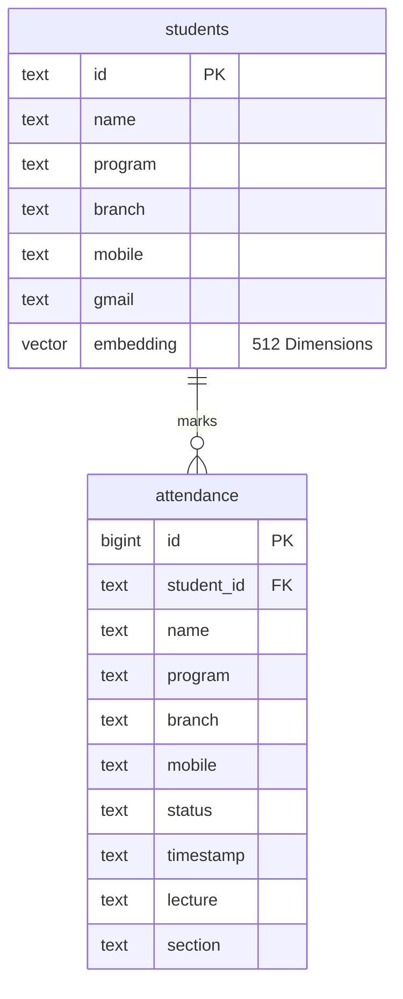

# 🛡️ BioSecure AI Comprehensive System Report

Welcome to the official technical documentation and systems architecture report for **BioSecure AI**. 

This document provides an exhaustive, production-grade description of the application's architecture, database schemas, processing algorithms, frontend aesthetics, API endpoints, security protocols, and deployment strategies.

---

## 1. Executive Summary & Brand Identity

**BioSecure AI** is a state-of-the-art, **stateless** facial-recognition-based attendance tracking platform. Built primarily with a Flask backend, the system leverages high-performance AI inference locally via ONNX Runtime and offloads the complex high-dimensional vector search to a PostgreSQL database utilizing the `pgvector` extension. 

### Brand & Design System (BioSecure AI Aesthetics)
The user interface follows the **BioSecure AI Design System**, implementing a premium "dark glassmorphism" aesthetic designed for maximum readability, fast administrative access, and visual polish.

* **Layout & Container Styling**:
  * Backdrop Blur: `12px` (`backdrop-blur-md`)
  * Container Background: `rgba(24, 24, 27, 0.65)` (Zinc-900 with transparency)
  * Border Stroke: `1px solid rgba(255, 255, 255, 0.08)`
  * Border Radius: `rounded-xl` (12px) for cards, `rounded-lg` (8px) for buttons/inputs.
* **Harmonious Color Palette**:
  * **Background**: `#09090b` (Zinc-950)
  * **Text Primary**: `#fafafa` (Zinc-50)
  * **Text Secondary**: `#a1a1aa` (Zinc-400)
  * **Accent / Primary**: `#6366f1` (Indigo-500)
  * **Success (Present)**: `#10b981` (Emerald-500)
  * **Danger (Delete/Logout)**: `#ef4444` (Red-500)
* **Typography**:
  * Clean, geometric sans-serif font pairing utilizing **Inter** via Google Fonts.

---

## 2. High-Level Architecture & System Flowcharts

The system operates as a stateless machine. It does not store face templates locally in pickle or numpy format files in production; instead, it generates a 512-dimensional vector embedding on the fly and immediately routes it to the database for matching.

### 2.1. System Data Flow
The diagram below illustrates the exact request-response path an image takes from the client browser through the AI inference layer to the Supabase database.

```mermaid
graph TD
    Browser[Web Browser / Client UI] -->|1. HTTP POST Image + Metadata| Flask[Flask Backend]
    
    subgraph AI Inference Layer (Flask Server)
        Flask -->|2. Decode bytes to CV2| Decode[cv2.imdecode]
        Decode -->|3. Get Face Analysis| Insight[InsightFace buffalo_l]
        Insight -->|4. Generate 512D Vector| Emb[Raw Embedding]
        Emb -->|5. L2 Normalization| NormEmb([Normalized Embedding])
    end
    
    subgraph Database Layer (Supabase / pgvector)
        NormEmb -->|6. RPC: match_face| RPC[match_face Function]
        RPC -->|7. Cosine Distance <= Metric| Index[pgvector Index]
        Index -->|8. Fetch ID & Similarity| StudentTab[(students Table)]
    end
    
    StudentTab -->|9. Returns Match| Flask
    Flask -->|10. Cooldown & Attendance Log| AttendanceTab[(attendance Table)]
    Flask -->|11. Annotated Image + JSON Result| Browser

    style Browser fill:#6366f1,stroke:#fafafa,stroke-width:2px,color:#fff
    style Flask fill:#18181b,stroke:#6366f1,stroke-width:2px,color:#fff
    style Insight fill:#312e81,stroke:#6366f1,stroke-width:1px,color:#fff
    style RPC fill:#064e3b,stroke:#10b981,stroke-width:2px,color:#fff
    style StudentTab fill:#0f172a,stroke:#38bdf8,stroke-width:1px,color:#fff
```

### 2.2. Student Registration Flow
When registering a new student, the system parses the image, computes the embedding, saves the profile photo locally as a fallback, and inserts the normalized vector directly into Supabase.



### 2.3. Attendance Marking Sequence
During live attendance capturing, the client takes snapshots via the webcam. The Flask backend processes each frame in the request stream, matches it using Cosine Similarity, checks the cooldown constraint, and registers the attendance.



---

## 3. Technology Stack Breakdown

| Technology | Layer | Purpose | Description / Version |
| :--- | :--- | :--- | :--- |
| **Flask** | Backend Framework | Routing & Blueprints | v3.1.1 — Python application framework handling cookies, session data, routes, and page renders. |
| **InsightFace** | AI Inference | Face Detection & Embedding | v0.7.3 — Employs the `buffalo_l` model consisting of RetinaFace (for detection) and ArcFace (for generating 512D embeddings). |
| **ONNX Runtime** | Execution Engine | AI Acceleration | v1.22.1 — Runs the compiled ONNX model files efficiently. CPU execution default, support for CUDA (GPU). |
| **Supabase SDK** | Database Integration | PostgreSQL Client | Python client interface querying Tables and invoking RPCs over HTTPS via HTTP POST REST. |
| **pgvector** | DB Extension | Vector Similarity | PostgreSQL extension enabling vector column types and similarity operators (Cosine, L2, Inner Product). |
| **OpenCV** | Image Processing | Image I/O & Graphics | v4.12.0 — Decodes byte streams, crops bboxes, and overlays labels on annotated frames. |
| **TailwindCSS** | Frontend Styling | Visual Presentation | Responsive UI framework driving glassmorphic dark theme and layouts. |
| **Gunicorn** | Application Server | WSGI Server | v23.0.0 — Production-grade HTTP server managing worker processes. |
| **Nginx** | Reverse Proxy | Web Server / Security | Production-facing reverse proxy handling cached static content, TLS offloading, and request routing. |

---

## 4. Database Architecture & Schema Design

All application states are persisted inside a managed PostgreSQL database powered by Supabase. Two primary tables and a custom RPC function coordinate vector comparisons.

### 4.1. Entity Relationship Diagram (ERD)



### 4.2. Database DDL SQL Scripts
To set up or migrate the database, execute the following script in the Supabase SQL Editor:

```sql
-- 1. Enable the pgvector extension to support the vector type
CREATE EXTENSION IF NOT EXISTS vector;

-- 2. Create the students registry table
CREATE TABLE students (
  id text PRIMARY KEY,
  name text NOT NULL,
  program text,
  branch text,
  mobile text,
  gmail text,
  embedding vector(512) -- ArcFace model embedding dimensions
);

-- 3. Create the attendance logs table
CREATE TABLE attendance (
  id bigint GENERATED ALWAYS AS IDENTITY PRIMARY KEY,
  student_id text REFERENCES students(id) ON DELETE SET NULL,
  name text,
  program text,
  branch text,
  mobile text,
  status text,
  timestamp text, -- Format: YYYY-MM-DD HH:MM:SS
  lecture text,
  section text
);
```

### 4.3. High-Dimensional Similarity Function (`match_face`)
In older systems, face matching occurred on the server by loading all encodings from a local file and iterating over them in Python. In BioSecure AI, this process is offloaded to PostgreSQL using a custom SQL function:

```sql
CREATE OR REPLACE FUNCTION match_face (
  query_embedding vector(512),
  match_threshold float
)
RETURNS TABLE (
  id text,
  name text,
  similarity float
)
LANGUAGE sql STABLE
AS $$
  SELECT
    id,
    name,
    1 - (embedding <=> query_embedding) AS similarity -- Cosine Similarity
  FROM students
  WHERE embedding IS NOT NULL AND 1 - (embedding <=> query_embedding) >= match_threshold
  ORDER BY embedding <=> query_embedding -- Order by Cosine Distance ascending
  LIMIT 1;
$$;
```

#### Vector Math Explanation:
The `<=>` operator computes the **Cosine Distance** between two vectors $A$ and $B$, defined as:
$$\text{Cosine Distance}(A, B) = 1 - \frac{A \cdot B}{\|A\| \|B\|}$$
Since we want the **Cosine Similarity**, we compute:
$$\text{Cosine Similarity}(A, B) = 1 - \text{Cosine Distance}(A, B)$$
A threshold of `0.3` is defined as the baseline for a positive face match. A value of `1.0` represents a perfect identical match, whereas lower values accommodate differences in lighting, facial hair, and angles.

---

## 5. API & Blueprint Routing Specifications

The backend code is modularized into four distinct Flask Blueprints registered in `app.py`. All non-public routes enforce authentication via a `@app.before_request` hook.

### 5.1. Endpoints Directory

| Route | Method | Access Level | Description |
| :--- | :--- | :--- | :--- |
| `/login` | `GET`, `POST` | Public | Authenticates user credentials via Supabase Auth and sets session variables. |
| `/logout` | `GET` | Authenticated | Clears the Flask session and calls Supabase `sign_out`. |
| `/register` | `GET`, `POST` | Admin Only | Allows administrator to create new staff accounts via Supabase Admin API. |
| `/` | `GET` | Authenticated | Serves the main attendance taking control center. |
| `/viewer` | `GET` | Authenticated | Renders the student attendance logs viewer interface. |
| `/get_attendance_data` | `GET` | Authenticated | Returns full attendance logs as a JSON list of arrays for client-side rendering. |
| `/upload_photo` | `POST` | Authenticated | Processes base64/binary uploaded frames, runs inference, matches vectors, logs attendance. |
| `/students` | `GET` | Authenticated | Displays list of registered students. |
| `/add_student` | `GET` | Authenticated | Renders registration form. |
| `/submit_student` | `POST` | Authenticated | Processes new student registration, saves files, calculates embeddings, writes to database. |
| `/admin` | `GET` | Admin Only | Renders admin dashboard with totals. |
| `/admin/stats` | `GET` | Admin Only | Returns JSON formatted metrics: 7-day attendance trend, present vs absent counts. |
| `/admin/students` | `GET` | Admin Only | Admin view of students with Edit and Delete controls. |
| `/admin/student/edit/<id>`| `GET`, `POST` | Admin Only | Renders/submits modifications to student metadata. |
| `/admin/student/delete/<id>`| `POST` | Admin Only | Deletes a student from PostgreSQL. |
| `/admin/mark` | `GET`, `POST` | Admin Only | Manually marks a student present/absent without photo scan. |
| `/admin/view_images` | `GET` | Admin Only | Displays list of camera captures. |
| `/admin/users` | `GET` | Admin Only | Lists all registered staff users. |
| `/admin/user/edit/<id>` | `GET`, `POST` | Admin Only | Edits username, email, password, and admin status of accounts. |
| `/admin/user/delete/<id>` | `POST` | Admin Only | Deletes an account (prevents self-deletion/orphaning). |

---

## 6. Directory Structure & Key Files

The folder structure segregates the blueprints, template assets, static layouts, and helper modules.

```
Face-Attendance-System-Web-Version/
├── app.py                      # Main entrypoint, registers blueprints, configures session hooks.
├── config.py                   # Centralized configuration reading from environmental variables.
├── requirements.txt            # Python dependencies lists.
├── start_face_attendance.sh    # Convenience shell script for launcher script.
├── blueprints/                 # Modular Flask controller routing
│   ├── admin.py                # Admin dashboards, stats, user/student management controls.
│   ├── attendance.py           # Capture inputs, webcam handlers, vector lookup interfaces.
│   ├── auth.py                 # Supabase Auth interface logins, registration, and logouts.
│   └── students.py             # Student registration forms and vector insertions.
├── docs/                       # Technical manuals
│   ├── ARCHITECTURE.md
│   ├── DATABASE.md
│   ├── DEPLOYMENT.md
│   ├── DESIGN.md
│   ├── SETUP.md
│   └── SYSTEM_REPORT.md        # This detailed system analysis report.
├── known_faces/                # Fallback storage for registered student profile pictures.
├── nginx/
│   └── nginx.conf              # Production Nginx reverse proxy templates.
├── static/                     # Shared static assets (CSS, JS, Logos)
├── templates/                  # Tailwind-based glassmorphic HTML templates
└── utils/                      # Helper libraries
    ├── db.py                   # Exports Supabase standard and admin role clients.
    └── face.py                 # Initializes InsightFace buffalo_l models & normalizes arrays.
```

---

## 7. Security Model & Data Integrity

BioSecure AI relies on multi-layer security protections to secure physical access control logs and user credentials.

### 7.1. Authentication & Session Security
* **JWT Validation**: All user logins verify credentials against Supabase Identity Manager. Upon successful authentication, a JSON Web Token (JWT) is returned and the access token is stored in Flask's client-side cookie session.
* **Session Secrets**: Flask cookies are cryptographically signed using `FLASK_SECRET_KEY` (configured as a high-entropy 256-bit hexadecimal string).
* **Global Request Guards**: The request interceptor inside `app.py` blocks access to any page except `/login` and static folders unless `session['logged_in']` is validated.

### 7.2. Administrator Role Guard (RBAC)
User levels are distinguished by checking the metadata payload inside Supabase Auth:
```python
def _require_admin():
    if not session.get('is_admin'):
        return render_template('login.html', error="Admin access required")
    return None
```
Admin endpoints route through a helper check, and changes to staff privileges use the elevated service role client (`supabase_admin`).

### 7.3. Edge Protections & Input Sanitization
* **Path Traversal Protection**: During profile picture uploads, filenames are sanitized using `werkzeug.utils.secure_filename` to prevent malicious directory-traversal injections (`../../etc/passwd`).
* **SQL Injection Mitigation**: All direct SQL queries or database updates are executed using the Supabase SDK REST builder, which parameterizes all query values.
* **Safe Embedding Encoding**: Encodings are transferred as lists of floating-point values, and calculations are computed inside Supabase's PostgreSQL compiler environment, preventing local Python memory exploits.

---

## 8. Deployment & Scaling Architecture

To scale BioSecure AI from a small laboratory test to a university-wide system, deployment details must accommodate memory bounds.

```mermaid
graph LR
    User([Browser Client]) -->|HTTPS (443)| Nginx[Nginx Reverse Proxy]
    Nginx -->|Proxy Pass (Port 8000)| Gunicorn[Gunicorn WSGI Server]
    
    subgraph Local Server Core
        Gunicorn -->|Worker 1| App1[Flask App Instance]
        Gunicorn -->|Worker 2| App2[Flask App Instance]
        App1 -->|In-Memory Model| InsightFace[InsightFace buffalo_l]
        App2 -->|In-Memory Model| InsightFace
    end
    
    App1 -->|HTTPS RPC REST| Supabase((Supabase pgvector DB))
    App2 -->|HTTPS RPC REST| Supabase
```

### 8.1. System Requirements & Hardware Sizing
InsightFace model files (~300MB) are loaded into RAM at startup. Processing frames requires numerical array calculations:
* **Minimum specs**: 2GB of RAM, 1 vCPU.
* **Recommended specs**: 4GB+ of RAM, 2+ vCPUs, SSD storage.
* **GPU Speedup**: For large scale operations, configure `INSIGHTFACE_CTX_ID=0` (in `.env`) to utilize Nvidia CUDA cores, reducing inference delays from 800ms down to less than 50ms per frame.

### 8.2. WSGI Server & Reverse Proxy Configuration
Production environments run Gunicorn managed by Systemd, bound behind Nginx.

**Gunicorn Command**:
```bash
gunicorn -w 2 -t 120 -b 127.0.0.1:8000 app:app
```
* `-w 2` initializes two independent worker threads. Because database operations are stateless, multiple workers can handle separate client streams concurrently without file locking conflicts.
* `-t 120` raises worker timeout limits to 120 seconds, ensuring that heavy photos containing dozens of faces do not cause Gunicorn to restart workers mid-process.

**Nginx Configuration Essentials (`nginx/nginx.conf`)**:
* **Static Assets Caching**: Serves standard stylesheets and javascript files directly from the `/static/` folder on the disk without loading the Python runtime, significantly improving delivery times.
* **Timeouts configuration**: Matches Gunicorn's timeouts with `proxy_read_timeout 120s`.
* **Security Headers**: Enforces `X-Frame-Options: SAMEORIGIN` to prevent clickjacking attacks, and sets `X-Content-Type-Options: nosniff`.

---

This technical report represents the structural overview of the **BioSecure AI** application. For installation and running commands, please refer to the [Setup Manual](./SETUP.md) and [Admin User Manual](./ADMIN_GUIDE.md).
