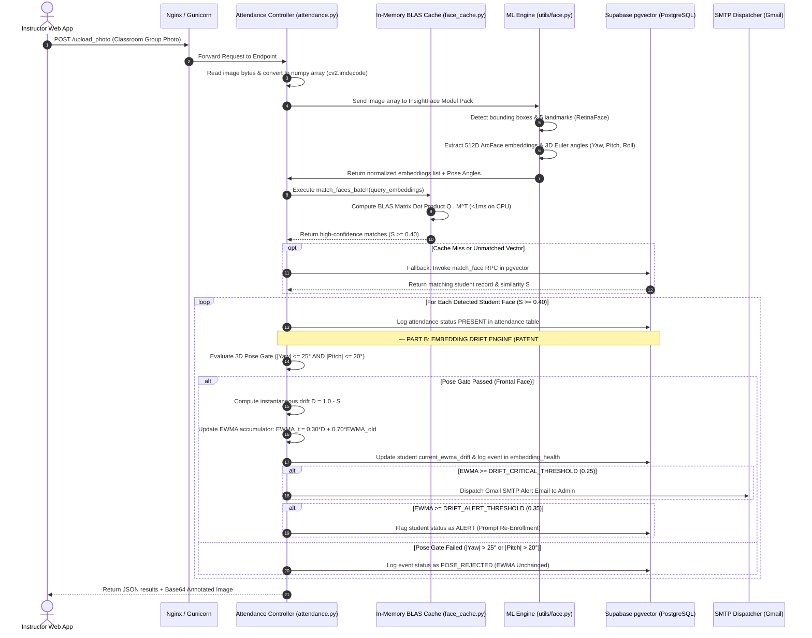

# 🏗️ System Architecture Guide

This document describes the design patterns, application structure, and execution lifecycles of **BioSecure AI**, detailing both the **Primary Facial Recognition Attendance Pipeline**, **RapidOCR ID Card Reader**, and the novel **Pose-Gated EWMA Embedding Drift Engine (2026 Patent Application)**.

---

## 📁 Production-Grade Directory Structure

BioSecure AI is organized using the standard **Python Application Factory** layout:

```
/
├── app.py                      # Flask development entrypoint
├── wsgi.py                     # Production WSGI entrypoint (gunicorn wsgi:app)
├── gunicorn.conf.py            # Gunicorn WSGI daemon configurations
├── Procfile                    # PaaS deployment process file
├── requirements.txt            # Python dependencies (Linux/macOS)
├── requirements-windows.txt    # Python dependencies (Windows)
├── start_face_attendance.sh    # Linux launcher script
├── start_face_attendance.bat   # Windows launcher script
│
├── IDF/                        # Official 2026 Patent Filing Package
│   ├── New Patent IDF.docx     # Invention Disclosure Form (Full System Architecture & Math)
│   └── Patent_Prior_Art_Search_Report.docx # Global Prior Art Search Report (2018-2026)
│
├── src/                        # Main Application Package
│   ├── __init__.py            # Application factory (create_app), error handlers & hooks
│   ├── config.py              # Centralized configuration constants (.env loader)
│   ├── blueprints/            # Blueprint route modules (Controllers)
│   │   ├── admin.py           # Admin portal, user RBAC, /admin/drift dashboard & resets
│   │   ├── attendance.py      # Attendance processing, group photo analysis, EWMA engine
│   │   ├── auth.py            # Supabase Auth login, logout, OAuth & session handling
│   │   └── students.py        # Student records, enrollment & /api/ocr_id_card OCR scanner
│   │
│   ├── utils/                 # Sub-system Utilities (Services)
│   │   ├── auth_helpers.py    # Rate limiting & brute-force protection
│   │   ├── db.py              # Supabase Client connections (Anon & Service Role)
│   │   ├── face.py            # InsightFace ArcFace 512D & 3D pose angle inference
│   │   ├── face_cache.py      # Thread-safe in-memory NumPy BLAS batch vector matrix matcher
│   │   └── ocr_helpers.py     # Pretrained Neural RapidOCR (ONNX DBNet+SVTR) & PyTesseract
│   │
│   ├── templates/             # Jinja2 HTML Templates (glassmorphic dark UI)
│   └── static/                # CSS, Tailwind, Lucide icons, particle canvas JS
│
├── known_faces/                # Storage directory for student enrollment portraits
├── nginx/                      # Nginx reverse proxy configuration templates
└── docs/                       # Comprehensive System Documentation Hub
```

---

## 🔄 Request Execution Lifecycle & Dual Pipeline

When an attendance photo is uploaded (`POST /upload_photo`), the request transitions through Nginx, Gunicorn, Flask Blueprint routing, the InsightFace ML engine, the in-memory BLAS matrix matcher, Supabase pgvector RPC fallback, and concurrently executes the Pose-Gated EWMA Drift Engine:



---

## ⚡ Concurrency, Memory & Scaling Architecture

1. **Thread-Safe In-Memory BLAS Matrix Cache (`src/utils/face_cache.py`)**:
   Upon application startup (`create_app`), all registered 512D student ArcFace embeddings are loaded into a contiguous NumPy array of shape $(M, 512)$ in memory. When group photos with $N$ detected faces are processed, vector matching executes as a single matrix multiplication $Q_{N \times 512} \cdot M_{512 \times M}^T$, obtaining Cosine similarity scores for all faces in $< 1\text{ ms}$ on CPU.
2. **Stateless WSGI Worker Model**:
   The Flask application holds no state on local disks. Student profiles, attendance logs, and drift health histories reside in Supabase PostgreSQL. Gunicorn worker processes operate independently, scaling horizontally across available CPU cores.
3. **Database Connection Efficiency**:
   Backend operations utilize Supabase PostgREST API client instances initialized with `SUPABASE_SERVICE_ROLE_KEY`. This eliminates traditional PostgreSQL socket exhaustion risks during high-concurrency attendance submission events.
