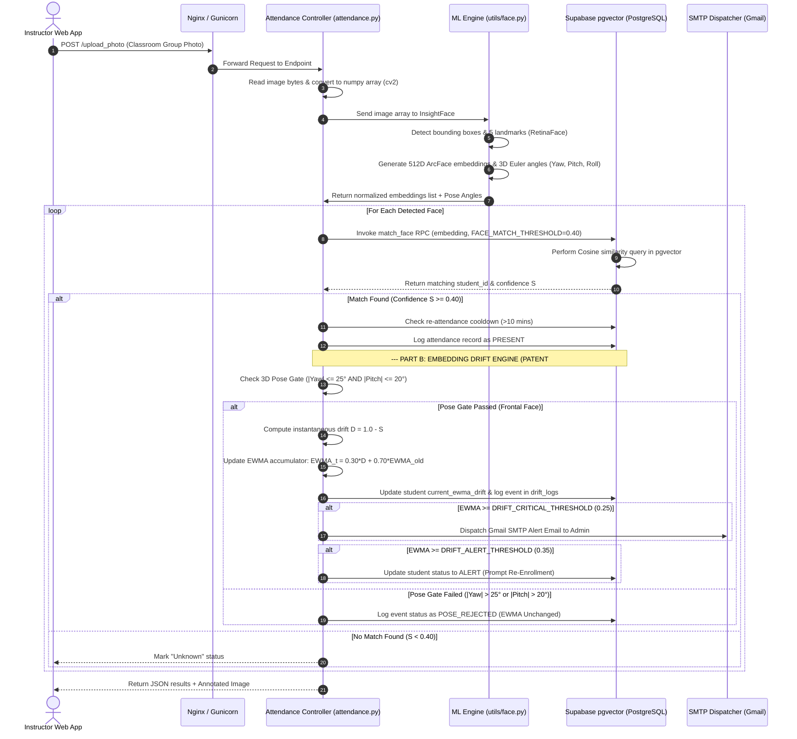

# 🏗️ System Architecture Guide

This document describes the design patterns, application structure, and execution lifecycles of **BioSecure AI**, including both the **Primary Facial Recognition Attendance Pipeline** and the novel **Pose-Gated EWMA Embedding Drift Engine (2026 Patent Application)**.

---

## 📁 Production-Grade Directory Structure

BioSecure AI is organized using the standard **Python Application Factory** layout:

```
/
├── app.py                      # Flask development entrypoint
├── wsgi.py                     # Production WSGI entrypoint (gunicorn wsgi:app)
├── config.py                   # Global configuration loading (.env mapping)
├── requirements.txt            # Project python dependencies
├── gunicorn.conf.py            # Gunicorn WSGI daemon configurations
├── Procfile                    # Deployment configuration for PaaS
│
├── IDF/                        # Official 2026 Patent Filing Package
│   ├── New Patent IDF.docx     # Invention Disclosure Form (Full System & Math)
│   └── Patent_Prior_Art_Search_Report.docx # Global Prior Art Search Report (2018-2026)
│
├── src/                        # Main Application Code
│   ├── __init__.py            # Application factory initialization (create_app)
│   ├── config.py              # Centralised configuration (overrides via .env)
│   ├── blueprints/            # Blueprint route modules (Controllers)
│   │   ├── admin.py           # Admin routes: user management, /admin/drift dashboard, resets
│   │   ├── attendance.py      # Attendance marking, group photo processing, EWMA drift engine
│   │   ├── auth.py            # User registration & session auth helpers
│   │   └── students.py        # Student records & enrollment management
│   │
│   ├── utils/                 # Sub-system Utilities (Services)
│   │   ├── auth_helpers.py    # Login rate limits & brute-force protection
│   │   ├── db.py              # Supabase Client connections (Anon & Service Role)
│   │   └── face.py            # InsightFace ArcFace 512D & pose angle inference
│   │
│   ├── templates/             # HTML Templates (Jinja2, admin_drift.html)
│   └── static/                # CSS, client JS, particle canvas assets
│
├── scripts/                    # Maintenance & Setup Scripts
└── docs/                       # System Documentation Hub
```

---

## 🔄 Request Execution Lifecycle & Dual Pipeline

When an attendance photo is uploaded, the request transitions through Nginx, Gunicorn, the Flask Blueprint, the ML face model, performs a vector matching query on Supabase, and concurrently executes the Pose-Gated EWMA Drift Engine:



---

## ⚡ Concurrency & Scaling Model

1. **Stateless WSGI**:
   The application holds zero state in-memory or on local disk. Since student embeddings are fetched/stored in Supabase, any worker process can handle any request independently.
2. **Process-Level Scaling**:
   We use **Gunicorn** to spawn multiple synchronous worker processes. Since facial recognition is CPU-intensive (ONNX running on CPU), having multiple Gunicorn workers allows the app to process multiple uploads in parallel.
3. **Database Connection Pooling**:
   Connections to Supabase are stateless HTTP calls via the PostgREST API, meaning there is no risk of running out of traditional PostgreSQL socket connection pools under heavy load.
