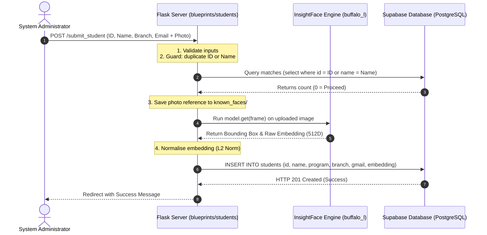
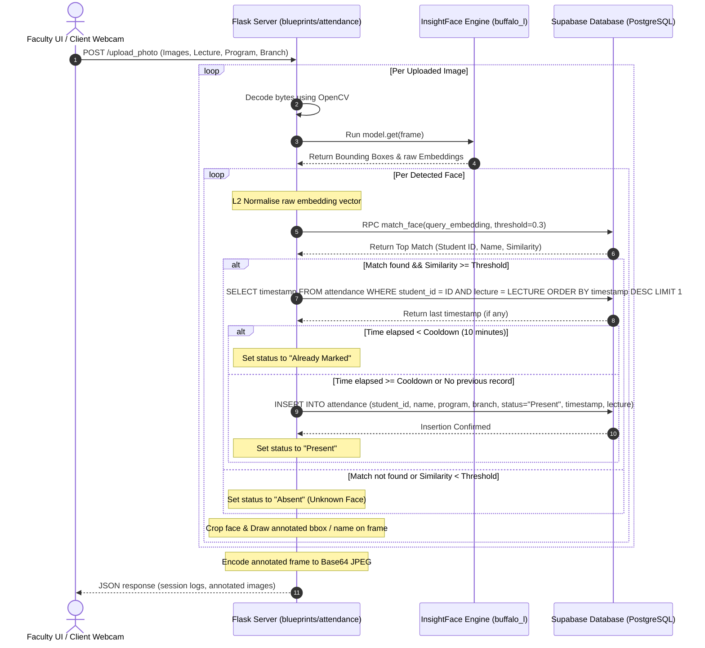

# 🏗️ System Architecture & Logic Flowcharts

This document describes the design patterns, runtime architecture, reverse proxy pipelines, and sequence flows of **BioSecure AI**.

---

## 1. Modular Execution Pipeline

The server stack utilizes **Nginx** as a reverse proxy, forwarding connection requests to **Gunicorn** which manages sync workers running the **Flask Application Factory**.

```
  [ Web Client ] 
        │ (HTTPS)
        ▼
  [ Nginx Reverse Proxy (Port 80/443) ]
        │ (HTTP proxy to loopback)
        ▼
  [ Gunicorn Process Manager (Port 8000) ]
        │ (WSGI Interface)
        ▼
  [ Flask Blueprint Router (create_app) ]
```

---

## 2. Interactive Logic Flowcharts

### 2.1 Student Registration Flow

When an administrator submits a new student profile, the server validates inputs, generates a face embedding from the photo, and stores the metadata alongside the vector in Supabase.



---

### 2.2 Facial Recognition & Attendance Marking Flow

The attendance marking process receives webcam frames or uploaded photos, aligns faces, processes matching vectors, checks cooldown constraints, and logs transactions.



---

## 3. Modular Blueprint Configuration

The backend is cleanly structured into Flask Blueprints to isolate responsibilities:

| Blueprint Module | Route Prefix | Responsibility |
| :--- | :--- | :--- |
| **`auth_bp`** | `/` | User login, registration, session validation, and logout. |
| **`students_bp`**| `/` | Directory listing of registered students and registration forms. |
| **`attendance_bp`**| `/` | Webcam index interface, live attendance processor, viewer history, and statuses. |
| **`admin_bp`** | `/admin` | Admin dashboards, student and user deletion, and manual marking forms. |
