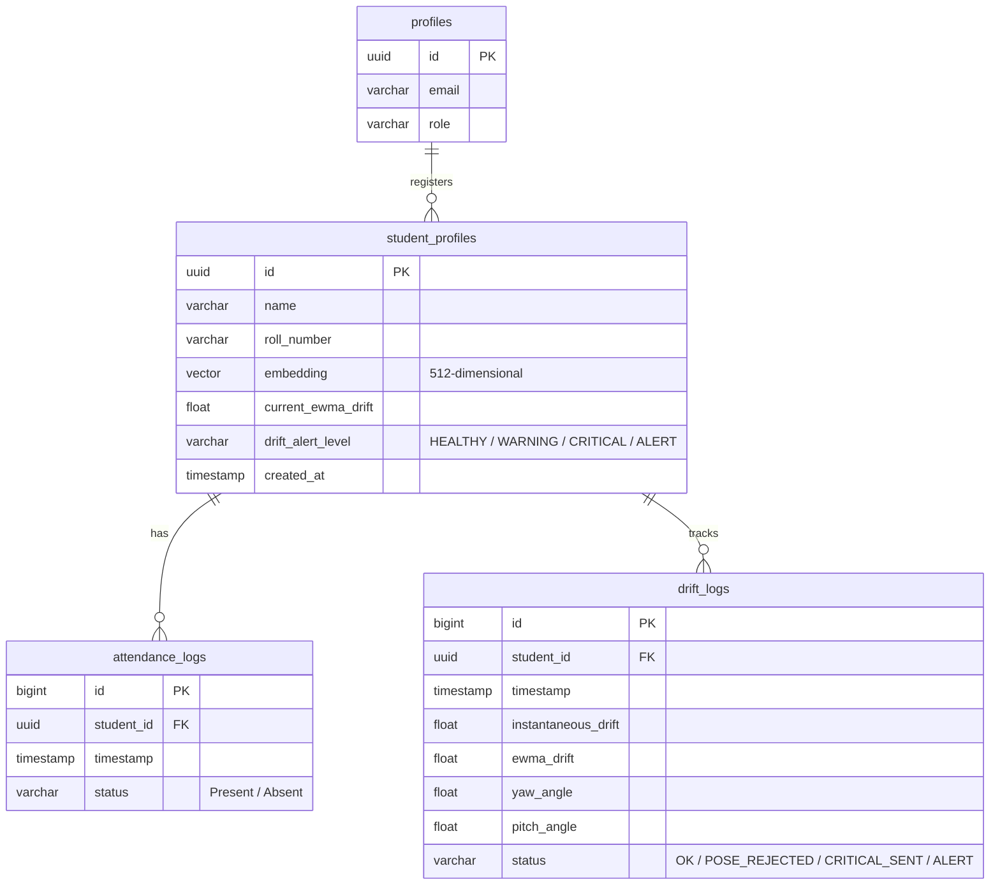

# 🗄️ Database & pgvector Guide

BioSecure AI relies on **Supabase (PostgreSQL)** for identity, student records, face embeddings storage, attendance logging, and individual **Biometric Embedding Drift Tracking (2026 Patent Application)**.

---

## 📊 Database Schema Layout

Below is the entity-relationship diagram illustrating the schema relations:



---

## 🛠️ PostgreSQL Table Definitions

Here are the complete SQL schema statements:

```sql
-- 1. Enable pgvector extension
CREATE EXTENSION IF NOT EXISTS vector;

-- 2. Create student profiles table with EWMA drift tracking
CREATE TABLE public.student_profiles (
    id UUID PRIMARY KEY DEFAULT gen_random_uuid(),
    name VARCHAR(255) NOT NULL,
    roll_number VARCHAR(100) UNIQUE NOT NULL,
    embedding VECTOR(512),                           -- ArcFace 512D facial embedding
    current_ewma_drift FLOAT DEFAULT 0.0,            -- Running EWMA drift score (Patent #3)
    drift_alert_level VARCHAR(50) DEFAULT 'HEALTHY',  -- HEALTHY / WARNING / CRITICAL / ALERT
    created_at TIMESTAMP WITH TIME ZONE DEFAULT CURRENT_TIMESTAMP
);

-- Create HNSW Index for cosine distance calculations
CREATE INDEX ON public.student_profiles 
USING hnsw (embedding vector_cosine_ops);

-- 3. Create attendance logs table
CREATE TABLE public.attendance_logs (
    id BIGSERIAL PRIMARY KEY,
    student_id UUID NOT NULL REFERENCES public.student_profiles(id) ON DELETE CASCADE,
    timestamp TIMESTAMP WITH TIME ZONE DEFAULT CURRENT_TIMESTAMP,
    status VARCHAR(50) NOT NULL DEFAULT 'Present'
);

-- 4. Create drift logs history table (Patent #3 Engine)
CREATE TABLE public.drift_logs (
    id BIGSERIAL PRIMARY KEY,
    student_id UUID NOT NULL REFERENCES public.student_profiles(id) ON DELETE CASCADE,
    timestamp TIMESTAMP WITH TIME ZONE DEFAULT CURRENT_TIMESTAMP,
    instantaneous_drift FLOAT NOT NULL,
    ewma_drift FLOAT NOT NULL,
    yaw_angle FLOAT,
    pitch_angle FLOAT,
    status VARCHAR(50) NOT NULL DEFAULT 'OK'
);
```

---

## 🔍 Vector Similarity RPC Function (`FACE_MATCH_THRESHOLD = 0.40`)

To identify faces in milliseconds, the Flask backend executes a custom PostgreSQL RPC function performing Cosine distance lookups:

```sql
CREATE OR REPLACE FUNCTION public.match_face(
    query_embedding VECTOR(512),
    match_threshold FLOAT DEFAULT 0.40,
    match_count INT DEFAULT 1
)
RETURNS TABLE (
    id UUID,
    name VARCHAR(255),
    roll_number VARCHAR(100),
    similarity FLOAT
)
LANGUAGE plpgsql
SECURITY DEFINER
AS $$
BEGIN
    RETURN QUERY
    SELECT 
        sp.id, 
        sp.name, 
        sp.roll_number, 
        1 - (sp.embedding <=> query_embedding) AS similarity
    FROM public.student_profiles sp
    WHERE 1 - (sp.embedding <=> query_embedding) >= match_threshold
    ORDER BY sp.embedding <=> query_embedding ASC
    LIMIT match_count;
END;
$$;
```

---

## 🛡️ Row Level Security (RLS) Policies

To protect student biometric data (512D ArcFace embeddings) and sensitive student information (`gmail`, `name`, enrollment details), Row Level Security is active on Supabase:

### SQL Security Enforcement Script (`scripts/fix_supabase_security.sql`)

```sql
-- 1. Enable RLS on all tables
ALTER TABLE public.students ENABLE ROW LEVEL SECURITY;
ALTER TABLE public.attendance ENABLE ROW LEVEL SECURITY;
ALTER TABLE public.embedding_health ENABLE ROW LEVEL SECURITY;
ALTER TABLE public.academic_structure ENABLE ROW LEVEL SECURITY;

-- 2. Revoke default public/anon direct access
REVOKE ALL ON ALL TABLES IN SCHEMA public FROM anon;

-- 3. Create RLS Policies
-- 'students' Table: Authenticated read-only; anon access denied
CREATE POLICY "Authenticated users view students" 
    ON public.students FOR SELECT TO authenticated USING (true);

-- 'attendance' Table: Authenticated read-only; anon access denied
CREATE POLICY "Authenticated users view attendance" 
    ON public.attendance FOR SELECT TO authenticated USING (true);

-- 'academic_structure' Table: Authenticated read-only
CREATE POLICY "Authenticated read academic_structure" 
    ON public.academic_structure FOR SELECT TO authenticated USING (true);

-- 'embedding_health' Table: Restricted exclusively to service_role (bypasses RLS)
```

### Policy Matrix & Service Role Privileges

| Table | `anon` Access | `authenticated` Access | `service_role` (Flask Backend) |
|---|---|---|---|
| `students` | **DENIED** | `SELECT` | **FULL (ALL)** |
| `attendance` | **DENIED** | `SELECT` | **FULL (ALL)** |
| `embedding_health` | **DENIED** | **DENIED** | **FULL (ALL)** |
| `academic_structure` | **DENIED** | `SELECT` | **FULL (ALL)** |

> [!NOTE]
> The Flask application uses `SUPABASE_SERVICE_ROLE_KEY` (`supabase_admin` in `src/utils/db.py`), which natively bypasses RLS in Supabase. Backend operations continue operating with full access while public REST API endpoints are fully secured.

