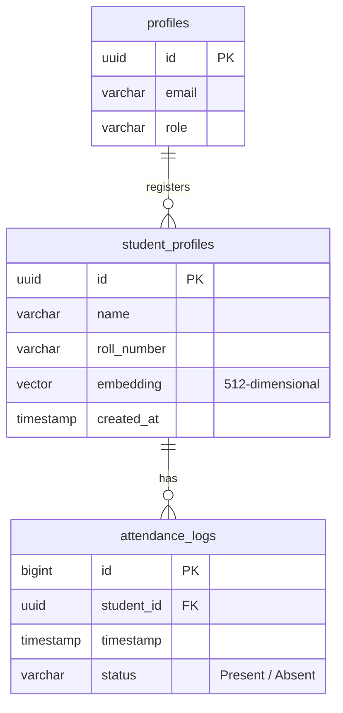

# 🗄️ Database & pgvector Guide

BioSecure AI relies on **Supabase (PostgreSQL)** for identity, student records, face embeddings storage, and attendance logging. High-dimensional vector search is performed directly in the database engine via the `pgvector` extension.

---

## 📊 Database Schema Layout

Below is the entity-relationship model illustrating the schema relations:



---

## 🛠️ PostgreSQL Table Definitions

Here are the SQL statements used to create and configure the tables:

```sql
-- 1. Enable pgvector extension
CREATE EXTENSION IF NOT EXISTS vector;

-- 2. Create student profiles table
CREATE TABLE public.student_profiles (
    id UUID PRIMARY KEY DEFAULT gen_random_uuid(),
    name VARCHAR(255) NOT NULL,
    roll_number VARCHAR(100) UNIQUE NOT NULL,
    embedding VECTOR(512), -- ArcFace facial embeddings (512D)
    created_at TIMESTAMP WITH TIME ZONE DEFAULT CURRENT_TIMESTAMP
);

-- Create HNSW Index for cosine distance calculations
CREATE INDEX ON public.student_profiles 
USING hnsw (embedding vector_cosine_ops);

-- 3. Create attendance logs table
CREATE TABLE public.attendance_logs (
    id BIGSERIAL PRIMARY KEY,
    student_id UUID NOT NULL REFERENCES public.student_profiles(id) ON DELETE CASCADE,
    timestamp TIMESTAMP WITH TIME ZONE DEFAULT CURRENT_TIMESTAMP,
    status VARCHAR(50) NOT NULL DEFAULT 'Present'
);
```

---

## 🔍 Vector Similarity RPC Function

To identify a face, the Flask application calls a custom stored procedure (RPC) inside the database. This function performs a cosine similarity lookup against all stored student embeddings:

```sql
CREATE OR REPLACE FUNCTION public.match_face(
    query_embedding VECTOR(512),
    match_threshold FLOAT,
    match_count INT
)
RETURNS TABLE (
    id UUID,
    name VARCHAR(255),
    roll_number VARCHAR(100),
    similarity FLOAT
)
LANGUAGE plpgsql
SECURITY DEFINER
AS $$
BEGIN
    RETURN QUERY
    SELECT 
        sp.id, 
        sp.name, 
        sp.roll_number, 
        1 - (sp.embedding <=> query_embedding) AS similarity
    FROM public.student_profiles sp
    WHERE 1 - (sp.embedding <=> query_embedding) >= match_threshold
    ORDER BY sp.embedding <=> query_embedding ASC
    LIMIT match_count;
END;
$$;
```

---

## 🛡️ Row Level Security (RLS) Policies

To protect student data, Row Level Security is active on Supabase. Only authenticated system administrators can write or execute modifications, while teachers have read access:

- **student_profiles Table**:
  - `SELECT`: Enabled for authenticated users.
  - `INSERT`, `UPDATE`, `DELETE`: Only allowed for service role (Flask admin context) or authenticated users with the `admin` role in their profile.
- **attendance_logs Table**:
  - `SELECT`: Enabled for authenticated users.
  - `INSERT`: Enabled for authenticated users.
  - `UPDATE`, `DELETE`: Restricted to administrators.
