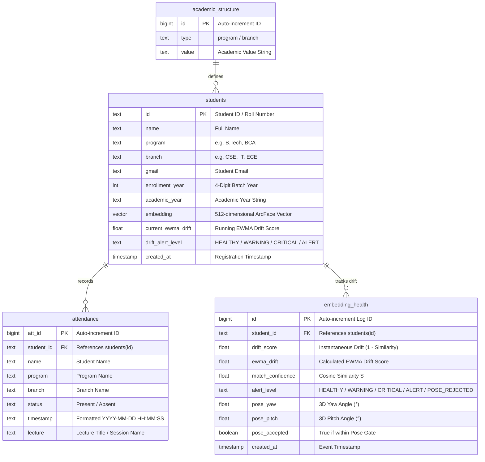

# 🗄️ Database & pgvector Guide

BioSecure AI relies on **Supabase (PostgreSQL)** for identity, student records, 512D ArcFace embeddings storage, attendance logging, academic structures, and individual **Biometric Embedding Drift Tracking (2026 Patent Application)**.

---

## 📊 Database Entity-Relationship Diagram

Below is the entity-relationship diagram illustrating the schema relations across all tables:



---

## 🛠️ Complete PostgreSQL Schema Statements

Below are the complete DDL scripts for table initialization, HNSW vector indexing, and foreign key constraints:

```sql
-- 1. Enable pgvector extension
CREATE EXTENSION IF NOT EXISTS vector;

-- 2. Create Student Profiles Table
CREATE TABLE public.students (
    id TEXT PRIMARY KEY,                             -- Student Roll / ID (e.g., CU240251013)
    name TEXT NOT NULL,                              -- Full Student Name
    program TEXT,                                    -- Academic Program (e.g., B.Tech)
    branch TEXT,                                     -- Academic Branch (e.g., CSE)
    gmail TEXT,                                      -- Student Email Address
    enrollment_year INT,                             -- Enrollment / Batch Year (e.g., 2024)
    academic_year TEXT,                              -- Academic Session String
    embedding VECTOR(512),                           -- ArcFace 512D facial embedding vector
    current_ewma_drift DOUBLE PRECISION DEFAULT 0.0, -- Current EWMA Drift Score (Patent #3)
    drift_alert_level TEXT DEFAULT 'HEALTHY',        -- Alert level: HEALTHY/WARNING/CRITICAL/ALERT
    created_at TIMESTAMP WITH TIME ZONE DEFAULT CURRENT_TIMESTAMP
);

-- Create HNSW Index for ultra-fast Cosine similarity queries
CREATE INDEX IF NOT EXISTS idx_students_embedding_hnsw 
ON public.students 
USING hnsw (embedding vector_cosine_ops);

-- 3. Create Attendance Logs Table
CREATE TABLE public.attendance (
    att_id BIGSERIAL PRIMARY KEY,
    student_id TEXT NOT NULL REFERENCES public.students(id) ON DELETE CASCADE,
    name TEXT,
    program TEXT,
    branch TEXT,
    status TEXT NOT NULL DEFAULT 'Present',
    timestamp TEXT NOT NULL,                         -- Date/Time string: YYYY-MM-DD HH:MM:SS
    lecture TEXT NOT NULL                            -- Lecture / Session identifier
);

-- Index attendance table for fast date and student queries
CREATE INDEX IF NOT EXISTS idx_attendance_student_id ON public.attendance(student_id);
CREATE INDEX IF NOT EXISTS idx_attendance_timestamp ON public.attendance(timestamp);

-- 4. Create Embedding Health & Drift Logs History Table (Patent #3)
CREATE TABLE public.embedding_health (
    id BIGSERIAL PRIMARY KEY,
    student_id TEXT NOT NULL REFERENCES public.students(id) ON DELETE CASCADE,
    drift_score DOUBLE PRECISION,                    -- Instantaneous drift score (1.0 - S)
    ewma_drift DOUBLE PRECISION,                     -- Running EWMA score
    match_confidence DOUBLE PRECISION,               -- Cosine similarity match score S
    alert_level TEXT NOT NULL,                       -- HEALTHY / WARNING / CRITICAL / ALERT / POSE_REJECTED
    pose_yaw DOUBLE PRECISION,                       -- Head Yaw Angle (degrees)
    pose_pitch DOUBLE PRECISION,                     -- Head Pitch Angle (degrees)
    pose_accepted BOOLEAN DEFAULT TRUE,             -- True if passed 3D Pose Gate
    created_at TIMESTAMP WITH TIME ZONE DEFAULT CURRENT_TIMESTAMP
);

CREATE INDEX IF NOT EXISTS idx_embedding_health_student_id ON public.embedding_health(student_id);

-- 5. Create Academic Structure Reference Table
CREATE TABLE public.academic_structure (
    id BIGSERIAL PRIMARY KEY,
    type TEXT NOT NULL,                              -- 'program' or 'branch'
    value TEXT NOT NULL,                             -- e.g. 'B.Tech', 'CSE'
    CONSTRAINT unique_academic_type_value UNIQUE (type, value)
);
```

---

## 🔍 Cosine Vector Similarity RPC Function

To execute fallback in-database vector searches, the Flask backend calls a custom PostgreSQL Stored Procedure:

```sql
CREATE OR REPLACE FUNCTION public.match_face(
    query_embedding VECTOR(512),
    match_threshold DOUBLE PRECISION DEFAULT 0.40,
    filter_program TEXT DEFAULT NULL,
    filter_branch TEXT DEFAULT NULL,
    filter_section TEXT DEFAULT NULL
)
RETURNS TABLE (
    id TEXT,
    name TEXT,
    program TEXT,
    branch TEXT,
    similarity DOUBLE PRECISION
)
LANGUAGE plpgsql
SECURITY DEFINER
AS $$
BEGIN
    RETURN QUERY
    SELECT 
        s.id, 
        s.name, 
        s.program, 
        s.branch, 
        (1.0 - (s.embedding <=> query_embedding))::DOUBLE PRECISION AS similarity
    FROM public.students s
    WHERE s.embedding IS NOT NULL
      AND (1.0 - (s.embedding <=> query_embedding)) >= match_threshold
      AND (filter_program IS NULL OR s.program ILIKE filter_program)
      AND (filter_branch IS NULL OR s.branch ILIKE filter_branch)
    ORDER BY s.embedding <=> query_embedding ASC
    LIMIT 1;
END;
$$;
```

---

## 🛡️ Row-Level Security (RLS) Configuration (`scripts/fix_supabase_security.sql`)

To protect student biometric data (512D embeddings) and student PII, Row-Level Security is active on Supabase:

```sql
-- Enable RLS on all tables
ALTER TABLE public.students ENABLE ROW LEVEL SECURITY;
ALTER TABLE public.attendance ENABLE ROW LEVEL SECURITY;
ALTER TABLE public.embedding_health ENABLE ROW LEVEL SECURITY;
ALTER TABLE public.academic_structure ENABLE ROW LEVEL SECURITY;

-- Revoke default public direct access
REVOKE ALL ON ALL TABLES IN SCHEMA public FROM anon;

-- Create RLS Read Policies for authenticated users
CREATE POLICY "Authenticated users view students" 
    ON public.students FOR SELECT TO authenticated USING (true);

CREATE POLICY "Authenticated users view attendance" 
    ON public.attendance FOR SELECT TO authenticated USING (true);

CREATE POLICY "Authenticated read academic_structure" 
    ON public.academic_structure FOR SELECT TO authenticated USING (true);
```

### Policy Access Matrix

| Table | `anon` Role | `authenticated` Role | `service_role` (Flask Backend) |
|---|---|---|---|
| `students` | **DENIED** | `SELECT` | **FULL (ALL)** |
| `attendance` | **DENIED** | `SELECT` | **FULL (ALL)** |
| `embedding_health` | **DENIED** | **DENIED** | **FULL (ALL)** |
| `academic_structure` | **DENIED** | `SELECT` | **FULL (ALL)** |

> [!NOTE]
> The Flask backend uses `SUPABASE_SERVICE_ROLE_KEY` (`supabase_admin` in `src/utils/db.py`), which bypasses RLS policies in Supabase. Backend operations continue operating with full administrative permissions while client REST endpoints remain locked down.
