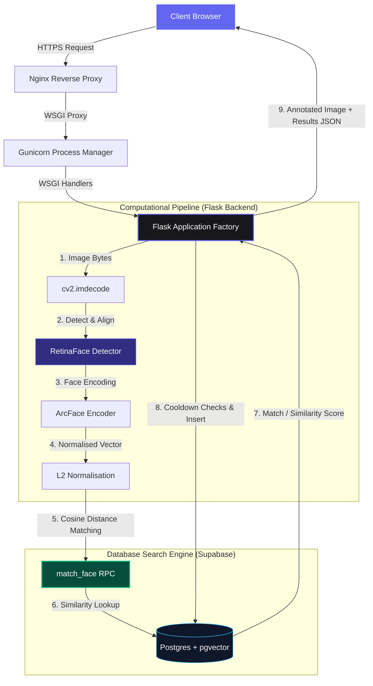

# 🛡️ BioSecure AI — Documentation Hub

Welcome to the official technical documentation portal for **BioSecure AI**. BioSecure AI is a production-ready, stateless, and high-performance automated facial recognition classroom attendance system. 

By leveraging local AI inference (via ONNX Runtime) and offloading vector embeddings search to a PostgreSQL database powered by Supabase and `pgvector`, BioSecure AI is fast, secure, and incredibly easy to scale.

---

## 🗺️ Documentation Directory

Explore the system through our dedicated sub-documentation modules:

| Document | Description | Core Contents |
| :--- | :--- | :--- |
| 🏗️ **[System Architecture](file:///home/dell/Face-Attendance-System-Web-Version/docs/architecture.md)** | Core components & logic flows | WSGI Factory pattern, Nginx/Gunicorn proxies, sequence flowcharts |
| 🗄️ **[Database & pgvector](file:///home/dell/Face-Attendance-System-Web-Version/docs/database.md)** | Storage layer & vector similarity | Table schemas, Row Level Security (RLS), custom cosine RPC matching |
| 🧠 **[ML & Inference Pipeline](file:///home/dell/Face-Attendance-System-Web-Version/docs/ml_pipeline.md)** | Facial recognition logic | InsightFace, ArcFace embeddings, RetinaFace alignment, L2 normalisation |
| 🔌 **[API Reference](file:///home/dell/Face-Attendance-System-Web-Version/docs/api_reference.md)** | REST endpoints manual | Endpoint schemas, request/response formats, status codes |
| 🌍 **[Ops & Deployment](file:///home/dell/Face-Attendance-System-Web-Version/docs/deployment.md)** | Production setup & guidelines | Gunicorn tuning, systemd setup, environment files |
| 👤 **[User & Admin Guide](file:///home/dell/Face-Attendance-System-Web-Version/docs/user_guide.md)** | How to use the app | Registering students, taking attendance, managing roles, reports |

---

## 🚀 High-Level Architecture Overview

BioSecure AI relies on a clean, stateless layout where computationally-heavy operations happen in the Flask backend, and matching operations are handled directly inside Postgres:

---

## ⚡ Core Technical Highlights

- **Stateless App Architecture**: The Flask application holds no state. No face templates are cached on server disks, allowing effortless horizontal scaling.
- **pgvector Integration**: Employs PostgreSQL's `pgvector` extension. Cosine similarity queries are calculated directly in-database in milliseconds.
- **Double-Match Cooldown Guard**: Prevents recording duplicate attendance logs within a configurable interval (default: 10 minutes).
- **Stunning Dark Glassmorphic Design**: Implements a visually premium user experience with modern canvas interactive particles, HSL curated colors, and clear feed loops.
