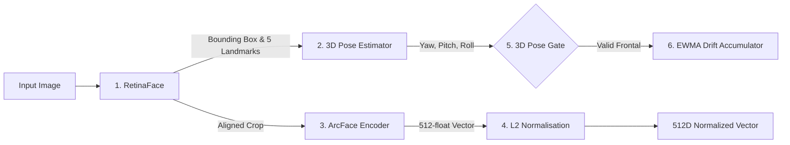

# 🧠 ML & Inference Pipeline Guide

BioSecure AI implements a state-of-the-art local facial recognition and biometric health monitoring pipeline. This document explains the mathematical foundations, models, 3D pose gating, and Exponentially Weighted Moving Average (EWMA) drift calculations.

---

## 🛠️ Model Details & Inference Architecture

The system employs **InsightFace** (specifically the `buffalo_l` model pack) running locally via ONNX Runtime inside the Python application container:

1. **RetinaFace (Detection & Landmarks)**:
   - Detects all face bounding boxes, confidence scores, and 5 facial landmarks (eyes, nose tip, mouth corners).
2. **3D Pose Estimation**:
   - Estimates 3D Euler head orientation angles: **Yaw** (left/right turning), **Pitch** (up/down tilting), and **Roll** (side tilting).
3. **ArcFace (Feature Extraction)**:
   - Generates a 512-dimensional floating-point embedding vector on a hyperspherical manifold.
4. **L2 Normalisation**:
   - Scales the 512-dimensional vector to have a Euclidean norm $\|v\|_2 = 1.0$.

---

## 📐 Vector Similarity & Cosine Mathematics

For a raw embedding vector $v = [v_1, v_2, \dots, v_{512}]$, L2 normalisation yields $\hat{v}$:
\[\hat{v} = \frac{v}{\|v\|_2} = \frac{v}{\sqrt{\sum_{i=1}^{512} v_i^2}}\]

The cosine similarity score $S$ between a live normalized vector $\hat{E}_{live}$ and stored enrollment vector $\hat{E}_{enroll}$ is:
\[S = \text{CosineSimilarity}(\hat{E}_{live}, \hat{E}_{enroll}) = \hat{E}_{live} \cdot \hat{E}_{enroll} = \sum_{i=1}^{512} (\hat{E}_{live})_i \cdot (\hat{E}_{enroll})_i\]

* **Match Condition**: Student marked PRESENT if $S \ge 0.40$ (`FACE_MATCH_THRESHOLD = 0.40`).

---

## 🛡️ Novel 3D Pose Gate & EWMA Embedding Drift Math (2026 Patent Application)

To solve **Biometric Template Aging** (gradual vector divergence due to beard growth, new haircuts, weight changes across semesters), BioSecure AI executes a parallel drift monitoring engine:

### 1. 3D Pose Gate Filtering
Group-photo artifacts (students looking at side desks or tilted heads) introduce false drift spikes. The 3D Pose Gate filters captures prior to drift evaluation:
\[\text{PoseGatePass} = \begin{cases} \text{TRUE} & \text{if } |\text{Yaw}| \le 25.0^\circ \text{ AND } |\text{Pitch}| \le 20.0^\circ \\ \text{FALSE} & \text{otherwise} \end{cases}\]

* If `FALSE`: Event is logged as `POSE_REJECTED` in `drift_logs`, and the student's EWMA drift accumulator remains unchanged.

### 2. Instantaneous Cosine Drift Calculation
For pose-approved captures, instantaneous drift $D_t$ at attendance session $t$ is:
\[D_t = 1.0 - S_t = 1.0 - \text{CosineSimilarity}(\hat{E}_{live, t}, \hat{E}_{enroll})\]

### 3. EWMA Accumulator Equation
To isolate true physical facial aging from single-session lighting variations, the system updates an Exponentially Weighted Moving Average (EWMA) score using smoothing factor $\alpha = 0.30$:
\[EWMA_t = \alpha \cdot D_t + (1 - \alpha) \cdot EWMA_{t-1} = 0.30 \cdot D_t + 0.70 \cdot EWMA_{t-1}\]

### 4. Multi-Tier Alert State Classifier
The running $EWMA_t$ score evaluates against configurable alert cutoffs:

| State | EWMA Range | System Action |
| :--- | :--- | :--- |
| **HEALTHY** | $EWMA < 0.15$ | Normal operations; template performing optimally. |
| **WARNING** | $0.15 \le EWMA < 0.25$ | Mild drift detected; logged for monitoring. |
| **CRITICAL** | $0.25 \le EWMA < 0.35$ | Moderate drift; dispatches automated Gmail SMTP warning to admin. |
| **ALERT** | $EWMA \ge 0.35$ | Severe drift; flags student on `/admin/drift` with single-click re-enrollment prompt. |
