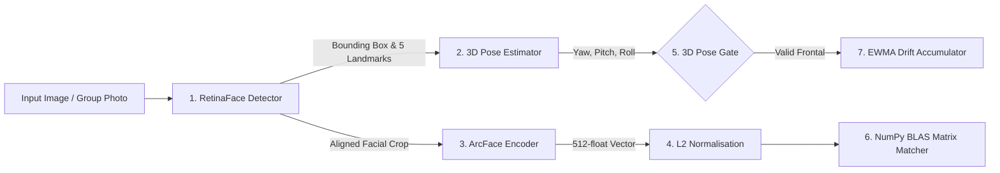

# 🧠 ML & Inference Pipeline Guide

BioSecure AI implements a state-of-the-art local facial recognition, deep learning neural OCR, and biometric health monitoring pipeline. This document details the underlying algorithms, model architectures, 3D pose gating, in-memory matrix matching math, and Exponentially Weighted Moving Average (EWMA) drift formulas.

---

## 🛠️ Model Architecture & Inference Flow

The system employs **InsightFace** (specifically the `buffalo_l` model pack running ONNX Runtime CPU/GPU execution providers) alongside **RapidOCR** (DBNet + SVTR ONNX neural models):

1. **RetinaFace (Face Detection & Alignment)**:
   - Detects all face bounding boxes $[x_1, y_1, x_2, y_2]$, confidence scores, and 5 key facial landmarks (left eye, right eye, nose tip, left mouth corner, right mouth corner).
2. **3D Pose Estimator**:
   - Computes 3D Euler head orientation angles: **Yaw** ($\psi$, left/right rotation), **Pitch** ($\theta$, up/down tilt), and **Roll** ($\phi$, side tilt).
3. **ArcFace Deep Feature Extractor**:
   - Maps aligned face crops onto a 512-dimensional feature vector space on a hyperspherical manifold.
4. **L2 Normalization Unit**:
   - Normalizes vector magnitude to $\|v\|_2 = 1.0$.
5. **In-Memory NumPy BLAS Batch Matrix Engine (`src/utils/face_cache.py`)**:
   - Performs matrix multiplication $Q \cdot M^T$ to compare $N$ live query vectors against $M$ enrolled student vectors in $<1\text{ ms}$ on CPU.

---

## 📐 Vector Normalization & Cosine Mathematics

For a raw feature vector $v = [v_1, v_2, \dots, v_{512}] \in \mathbb{R}^{512}$, L2 normalization produces $\hat{v}$:

\[\hat{v} = \frac{v}{\|v\|_2} = \frac{v}{\sqrt{\sum_{i=1}^{512} v_i^2}}\]

The Cosine Similarity score $S$ between a live normalized query vector $\hat{E}_{\text{live}}$ and stored reference vector $\hat{E}_{\text{enroll}}$ simplifies to their dot product:

\[S = \text{CosineSimilarity}(\hat{E}_{\text{live}}, \hat{E}_{\text{enroll}}) = \hat{E}_{\text{live}} \cdot \hat{E}_{\text{enroll}} = \sum_{i=1}^{512} (\hat{E}_{\text{live}})_i \cdot (\hat{E}_{\text{enroll}})_i\]

### In-Memory Batch Matrix Multiplication Formula

Given $N$ detected face query vectors arranged as matrix $Q \in \mathbb{R}^{N \times 512}$ and $M$ registered student embeddings as matrix $M \in \mathbb{R}^{M \times 512}$, the entire similarity matrix $C \in \mathbb{R}^{N \times M}$ is calculated in a single CPU BLAS instruction:

\[C = Q \cdot M^T\]

Where entry $C_{i, j}$ represents the Cosine similarity between query face $i$ and student $j$. The best match index $j^*$ for query face $i$ is:

\[j^* = \arg\max_{j} C_{i, j}, \quad \text{Condition: } C_{i, j^*} \ge 0.40 \ (\text{FACE\_MATCH\_THRESHOLD})\]

---

## 🛡️ Novel 3D Pose Gate & EWMA Embedding Drift Engine (2026 Patent Application)

To solve **Biometric Template Aging** (facial appearance variation caused by beard growth, new haircuts, aging, weight fluctuations across academic semesters), BioSecure AI runs a parallel biometric health tracking engine:

### 1. 3D Pose Gate Filtering
Group-photo captures often contain off-axis head angles (students looking away or tilting head). The 3D Pose Gate evaluates head orientation before approving drift updates:

\[\text{PoseGatePass} = \begin{cases} \text{TRUE} & \text{if } |\text{Yaw}| \le 25.0^\circ \ \land \ |\text{Pitch}| \le 20.0^\circ \\ \text{FALSE} & \text{otherwise} \end{cases}\]

- If `FALSE`: The event is logged in `embedding_health` as `POSE_REJECTED`, and the student's EWMA drift accumulator remains unchanged.

### 2. Instantaneous Cosine Drift Score
For pose-accepted captures, the instantaneous appearance drift $D_t$ at attendance session $t$ is:

\[D_t = 1.0 - S_t = 1.0 - \text{CosineSimilarity}(\hat{E}_{\text{live}, t}, \hat{E}_{\text{enroll}})\]

### 3. EWMA Accumulator Equation
To isolate genuine physical template aging from single-session lighting noise, the system updates an Exponentially Weighted Moving Average (EWMA) score using smoothing factor $\alpha = 0.30$:

\[EWMA_t = \alpha \cdot D_t + (1 - \alpha) \cdot EWMA_{t-1} = 0.30 \cdot D_t + 0.70 \cdot EWMA_{t-1}\]

### 4. Multi-Tier Alert State Classification

| Alert State | EWMA Score Range | System Action & Remediation |
| :--- | :--- | :--- |
| **HEALTHY** | $EWMA < 0.15$ | Template performing optimally; normal system logging. |
| **WARNING** | $0.15 \le EWMA < 0.25$ | Mild drift detected; logged for monitoring. |
| **CRITICAL** | $0.25 \le EWMA < 0.35$ | Moderate drift; dispatches automated Gmail SMTP warning email to admin. |
| **ALERT** | $EWMA \ge 0.35$ | Severe drift; flags student on `/admin/drift` with single-click re-enrollment prompt. |

---

## 💳 RapidOCR Deep Learning Neural ID Reader (`src/utils/ocr_helpers.py`)

BioSecure AI integrates **RapidOCR** (DBNet text detector + SVTR text recognizer ONNX models) and **PyTesseract** for zero-touch student onboarding from physical ID cards:

1. **Multi-Pass OpenCV Image Preprocessing**:
   - Converts ID card capture to high-resolution grayscale ($>1200\text{ px}$ width).
   - Generates inverted grayscale (converting white text on dark blue ID backgrounds into high-contrast black text on white background) and adaptive Gaussian thresholded variants.
2. **RapidOCR ONNX Inference**:
   - Detects text bounding polygons (DBNet) and recognizes alphanumeric characters (SVTR).
3. **Structured Regex Parsing (`parse_student_id_text`)**:
   - Extracts Student Name, Roll/Student ID (e.g. `CU240251013`), Program (`B.Tech`), Branch (`CSE`), Enrollment/Batch Year (`2024`), and email (`cu240251013@coeruniversity.ac.in`).
